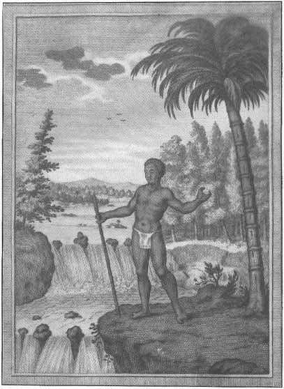

[Sacred-Texts](../../../index) [Native American](../../index) [South
American](../index) [Index](index) [Return to Text](aflg19.htm#pl7)

------------------------------------------------------------------------

|                              |                                   |
|------------------------------|----------------------------------:|
| BUREAU OF AMERICAN ETHNOLOGY | THIRTIETH ANNUAL REPORT   PLATE 7 |

A TOUVINGA, OR TWO-FINGERED NEGRO  
(After J. J. Hartsinck)

------------------------------------------------------------------------

[Return to Text](aflg19.htm#pl7)
