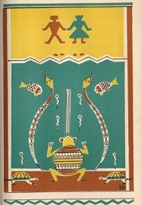

  
[Intangible Textual Heritage](../../../index)  [Native
American](../../index)  [Southeast](../index) 

------------------------------------------------------------------------

<table width="75%">
<colgroup>
<col style="width: 50%" />
<col style="width: 50%" />
</colgroup>
<tbody>
<tr class="odd">
<td width="50%" data-valign="TOP"></td>
<td width="50%" data-valign="CENTER"><h1 id="when-the-storm-god-rides" data-align="CENTER">When the Storm God Rides</h1>
<h4 id="tejas-and-other-indian-legends" data-align="CENTER">Tejas and Other Indian Legends</h4>
<h2 id="by-florence-stratton" data-align="CENTER">by Florence Stratton</h2>
<h3 id="collected-by-bessie-m.-reid" data-align="CENTER">collected by Bessie M. Reid</h3>
<h4 id="section" data-align="CENTER">[1936]</h4></td>
</tr>
</tbody>
</table>

------------------------------------------------------------------------

[Contents](#contents)    [Start Reading](wsgr00)

------------------------------------------------------------------------

This is a collection of Native American lore from Texas. It is focused
on the Tejas, a Caddoan group which called itself the Hasinai. The term
'Tejas' is from a Caddoan word which means 'friend,' and it gave us the
name of Texas. The Tejas lived between the Sabine and Trinity rivers, in
modern south-east Texas. They were the furthest west of the Southeastern
native groups, in close contact with the Plains tribes, so their
folklore reflects both regions.

Written in a simple declarative style to appeal to young readers, When
the Storm God Rides is not a work of ethnology, but is based on genuine
traditional folklore from the region. The material has been romanticized
by the author, and sometimes softened for the audience, although not to
the point of becoming maudlin as often occurs in this kind of book.
However, since there is a paucity of material on the southeastern Native
Americans, and specifically those from the Texas area, this fills a gap.

------------------------------------------------------------------------

 [Title Page and Front Matter](wsgr00)  
[Foreword](wsgr01)  
[Contents](wsgr02)  
[When the Storm God Rides](wsgr03)  
[How the North Wind Lost His Hair](wsgr04)  
[Kachina Brings the Spring](wsgr05)  
[The Sweet Gum's Amber Tears](wsgr06)  
[The Plant That Grows in Trees](wsgr07)  
[Why the Woodpecker Pecks](wsgr08)  
[The Woodpecker's Stumpy Tail](wsgr09)  
[Chief Two Hawks' Trail](wsgr10)  
[The Magnolia Babies](wsgr11)  
[Old Woolly Bird's Sacrifice](wsgr12)  
[A Tribe That Left Its Shoes](wsgr13)  
[The Cloud That Was Lost](wsgr14)  
[The Swift Blue One](wsgr15)  
[The Wise Man's Big Bald Head](wsgr16)  
[Grandmother River's Trick](wsgr17)  
[Why Hummingbirds Drink Only Dew](wsgr18)  
[When the Stars Took Root](wsgr19)  
[The Maiden Who Loved a Star](wsgr20)  
[Old Quanah's Gift](wsgr21)  
[How Sickness Entered the World](wsgr22)  
[The Evil Water Spirits](wsgr23)  
[Why the Irises Hold Hands](wsgr24)  
[The Pecan Tree's Best Friend](wsgr25)  
[When the Rainbow Was Torn](wsgr26)  
[Paisano, Hater of the Rattlesnake](wsgr27)  
[Maidens Who Broke a Drouth](wsgr28)  
[Why Arrows Have Feathers](wsgr29)  
[The Cottonwood Remembers](wsgr30)  
[Why the Skunk Walks Alone](wsgr31)  
[How the Turkey Hid Her Eggs](wsgr32)  
[Why the Dog's Ears Flop](wsgr33)  
[About the Tejas Indians](wsgr34)  
[Interesting Things to Do](wsgr35)  
[Indian Symbols](wsgr36)  
