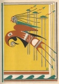

  
[Intangible Textual Heritage](../../../index)  [Native
American](../../index)  [Southeast](../index)  [Index](index) 
[Previous](wsgr02)  [Next](wsgr04) 

------------------------------------------------------------------------

*When the Storm God Rides*, by Florence Stratton, collected by Bessie M.
Reid \[1936\], at Intangible Textual Heritage

------------------------------------------------------------------------

p. 1

### When the Storm God Rides

The shores of Texas along the Gulf of Mexico did not always have islands
along them. The Indians who lived a long time ago on the coast have left
behind them the story of a god and his great black-winged thunder bird
which he rode like a horse over the Gulf at certain times. He was the
Storm God, and he made islands where none had been before. These islands
were made as homes for the wild birds, the sea gulls, the big pelicans,
the cranes and the herons.

The god of storms did not live among the Indians, but lived down in the
warm seas below the Gulf of Mexico. And for this the Indians were glad,
for his terrible

p. 2

thunder bird, named Hurakan, filled the people with fear. The tribes
which lived near the Gulf only saw the mighty god when he rode his
thunder bird through the skies. He visited their land when he wanted to
get the white and colored feathers of birds living on the seashore for
his cloak. The Indians could tell when he was on the way. As Hurakan,
the thunder bird, came swiftly through the air over the gulf, the sky in
front of him became filled with bits of white clouds sailing high over
the beaches. Then the wind began to blow, first here, then there. At
last came the great thunder bird in the shape of a cloud which closed
the eye of the sun and made the land dark. Then the wind

[  
Click to enlarge](img/00200.jpg)

p. 3

grew strong and howled and blew as the god and his thunder bird came
flying through the sky. The Indians ran into their wigwams and held them
down as best they could while the Storm God rushed by and snatched
feathers from birds to put on his cloak. The Indians were happy when he
was gone because Hurakan made them afraid. Even today Hurakan comes back
once in a while in the shape of a storm which people call a hurricane.

There was a day when the peaceful tribes who fished in the Gulf were
driven away from their homes by fierce tribes from the north. Unlike the
Indians who lived on the coast these tribes liked to kill. When they saw
the birds flying

p. 4

around, they shot them with arrows. They caught them on their roosts at
night. They robbed their nests. The poor birds cried out at the tops of
their voices for the Storm God to save them.

Far off down in his home in the warm seas the god lifted his head and
heard their cries. Quickly he rose to his feet and shook himself.
Thunder broke loose over his head, so angry was he. He ran and jumped
upon the back of Hurakan. He shouted for Hurakan to hurry. Shooting fire
like lightning from his eyes and shaking loose black clouds from the
tips of his great wings the Storm God's thunder bird flew toward the
Texas coast. He and the god were wrapped in darkness, and as they flew
across the sky the day

p. 5

became like night and the waters of the Gulf broke into white foam.

The Indians who were killing the birds saw the thunder god coming too
late to get away. The sun was gone and the clouds were so thick that the
day was like night. The wind from Hurakan's wings hit the Indians and
blew them down when they tried to run. Behind them came the waters of
the Gulf, pushed upon the land by the wind stirred up by the Storm God's
thunder bird. The wind \` blew the birds high in the air, but it drove
the water into the camps of the bad Indians and scattered their homes
and made the Indians climb into trees. The Gulf now poured far inland
over the prairie, and the prairie was like the sea.

p. 6

\[paragraph continues\] Everywhere was
rolling water, leaping waves, crying winds. High above the earth the
Storm God rode his thunder bird and shouted with joy while the wind blew
his long hair loose through the flying clouds.

At last the god went away. As he left, the waters of the Gulf began to
roll back from the land, and when they reached the ocean bed again they
dropped the mud and sand they had torn loose from the land and brought
with them. The mud and sand began to pile up. Soon many islands were
forming. They rose higher and higher as the waters kept dropping their
loads of earth around them. When all was done the Texas coast was dotted
with islands that were

p. 7

new homes for the birds. Indians could not reach those birds any longer.
The pelicans, the gulls, the sand pipers and all the others now went to
their new homes and made their nests where they could be safe and where
the Storm God could find them when he wanted new feathers for his cloak.

To this day those islands remain. Dwarf trees, cactus plants, weeds,
grasses and flowers cover them like fairy gardens. And thousands of
birds live on them, sing amid the bushes and bathe in the little pools
left by the rains. During spring and summer they lay their eggs and
raise their little ones. They are happy and safe from men, because long
ago the Storm God built the islands for them.

------------------------------------------------------------------------

[Next: How the North Wind Lost His Hair](wsgr04)
