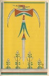

  
[Intangible Textual Heritage](../../../index)  [Native
American](../../index)  [Southeast](../index)  [Index](index) 
[Previous](wsgr06)  [Next](wsgr08) 

------------------------------------------------------------------------

*When the Storm God Rides*, by Florence Stratton, collected by Bessie M.
Reid \[1936\], at Intangible Textual Heritage

------------------------------------------------------------------------

p. 29

### The Plant That Grows in Trees

The mistletoe is a strange little plant. It does not live on the ground
with other plants, but always is found growing up in the limbs of trees
by itself. Only the birds can reach the little white berries which
appear both in summer and winter. That is why the mistletoe plant is
found only in trees. And a bird once put it there because it had pity on
the mistletoe.

There was a time when the mistletoe plant did grow on the ground as a
small bushy plant. One day when it was growing on the ground a bird
called by Indians the thunder bird, which they thought caused the
thunder, lit on the mistletoe. The thunder bird was hungry

p. 30

because it could find no berries on other plants. But it found berries
on the mistletoe and began to eat them. At last, when the bird had eaten
all it wanted of the little waxy white berries, it thanked the bush.

"I am glad you liked my berries," said the mistletoe. "I shall not be
here long because I shall soon die." Its leaves were drooping as if it
were very tired.

The thunder bird opened its red beak and asked, "Why must you die,
little plant?"

"Because I am green the year around," said the mistletoe. "My berries
grow in winter when the other berries are gone. Many animals feed on me.
They break off my brittle branches when they chew me. I shall not live
long."

[  
Click to enlarge](img/03000.jpg)

p. 31

Then the thunder bird took pity on the mistletoe because the bird had
liked the little berries. "I shall take you from the ground and put you
where the animals that walk on the earth cannot find you any more," said
the bird.

The thunder bird took the plant in its strong beak and flew up to the
top of a mesquite tree. It fastened the roots of the mistletoe into the
fork of a limb. Then the bird flew down to the ground and brought back
some earth on its beak and packed the earth around the roots of the
plant.

"Now, little Mistletoe," said the bird, "you will grow up here in this
tree, and the animals will not get your berries."

"Yes, I will grow but when I die my

p. 32

seeds will fall to the ground and they will suffer as I did," said the
mistletoe.

The thunder bird laughed and answered: "Oh, but I will see to that." The
bird then wiped his long bill, to which stuck some of the berries of the
mistletoe, on a limb. "See?" said the bird. "The berries stick on the
limb. They will grow there, like you. And whenever other birds eat your
berries they will wipe their bills as I do and the seeds of the
mistletoe will continue to grow forever and ever."

And that is why the mistletoe keeps growing in the trees.

------------------------------------------------------------------------

[Next: Why the Woodpecker Pecks](wsgr08)
