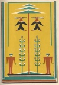

  
[Intangible Textual Heritage](../../../index)  [Native
American](../../index)  [Southeast](../index)  [Index](index) 
[Previous](wsgr07)  [Next](wsgr09) 

------------------------------------------------------------------------

*When the Storm God Rides*, by Florence Stratton, collected by Bessie M.
Reid \[1936\], at Intangible Textual Heritage

------------------------------------------------------------------------

p. 33

### Why the Woodpecker Pecks

When you hear a Tap! Tap! Tap! sounding in the top of a dead tree or at
the top of a telephone pole in the spring time you look up and what do
you see? A woodpecker, of course! No bird but the woodpecker and his
kinfolks pound on dead wood with their beaks.

You look up at the woodpecker and there he is, looking just like a
little man in a black coat and a red hat. And he is smart. If he sees
you looking at him he stops pecking and slips around the other side of
the limb or the pole and only sticks out his red head to peep at you.

There was a time when woodpeckers used to be Indians.

p. 34

A certain plant that grew on the desert was called the mescal plant.
Little knobs or buttons which grew on this plant had, when eaten, a
magic power. The Indians who ate them had visions or dreams. They could
see their gods and talk with their ancestors. But only those Indians who
were medicine men and had the right to see strange things had the right
to eat the mescal buttons. They warned everybody else not to touch them,
or bad luck would come to them.

One man did not listen to the medicine men. He wanted to know what the
medicine men saw in their dreams when they ate the mescal buttons and
then fell down to the ground or wandered about the camps singing with
their eyes closed.

[  
Click to enlarge](img/03400.jpg)

p. 35

\[paragraph continues\] This Indian boy
slipped out one night away from his people, when the wolves were howling
far off on the desert, and went to where the mescal plants were growing.
By the light of the bright stars he could see the buttons growing on the
plants. Half afraid, he picked one. Then he put it into his mouth.
Because it tasted good he picked more and he ate them. It was not long
before everything was strange before his eyes, and the desert seemed to
grow bright with light and to be filled with moving things that looked
like the gods the medicine men talked about. The boy was thrilled. When
he tried to walk towards the gods he fell down and wonderful colors
seemed to swim in the air around him as he lay

p. 36

on the ground. Then he fell asleep.

The next day the boy whispered to other boys what had happened to him
when he ate the mescal buttons. They were tempted by what he told them.
That night they slipped out of the camp with him and ate the buttons and
they saw the strange visions that he had seen on the desert. Then these
boys began to tell their fathers about it. The fathers ate the buttons
and they told their wives what they had seen. It was not long until all
the Indians of the tribe were eating them. They laughed when the
medicine man told them that trouble would come. They stopped hunting,
stopped weaving their blankets, stopped planting food, stopped gathering
berries.

p. 37

\[paragraph continues\] All they did was
to eat the mescal buttons and to roll on the ground while they had
strange visions.

The mothers and fathers forgot about their poor little children. At last
the children became so hungry that they began to wander around looking
for food. They wandered from the camp and began looking among the bushes
and trees and stones for something to eat.

After all the children had gone one young mother who had not eaten many
of the mescal buttons opened her eyes. When she saw that her child had
gone she looked quickly around the camp and could not see any of the
children at all. She then jumped to her feet and started crying out. She
beat the other Indians

p. 38

until they too awoke. Then they all began crying for their children, but
they could not find them.

What had happened to the children of the tribe? The Manitou, one of the
gods that make the clouds in the sky and hurl the lightning, had found
them hungry and hunting for food, and the Manitou had taken pity on
them. He had hidden them all away inside of hollow trees, where they
would be out of the hot sun and safe from the wolves.

The Manitou, when he saw the Indians looking for their children,
appeared before them and told them what he had done.

"Oh, what can we do to get them back again?" cried the weeping Indians
to the Manitou.

p. 39

"I will turn you into birds, and you can go look for them in the hollow
trees. When you find them I will turn you all back into people again,"
the Manitou said.

He waved his hand over the Indians. They became birds. The black robes
they were wearing turned into black feathers, and the red feathers they
wore in their hair turned into the red head of the woodpeckers. Then the
tribe flew off to the trees and began tapping every tree with their
sharp bills to find their children.

Even yet the woodpeckers tap the trees. When they find bugs they eat
them because they are hungry, but they keep on tapping to find their
children.

------------------------------------------------------------------------

[Next: The Woodpecker's Stumpy Tail](wsgr09)
