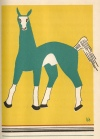

  
[Intangible Textual Heritage](../../../index.md)  [Native
American](../../index)  [Southeast](../index)  [Index](index.md) 
[Previous](wsgr14)  [Next](wsgr16.md) 

------------------------------------------------------------------------

*When the Storm God Rides*, by Florence Stratton, collected by Bessie M.
Reid \[1936\], at Intangible Textual Heritage

------------------------------------------------------------------------

p. 78

### The Swift Blue One

There was a time when the Indians had never seen a horse. When the first
Spanish explorers brought horses with them in their ships to this
country the Indians looked with great wonder upon the strangers as they
rode, and thought that the horse and the man on its back were one
animal. As time passed the Indians learned their mistake, but it was
long before they were able to get some of the strange animals for
themselves and to find out how to talk to them.

There was once a great blue horse that roamed the western plains. On his
back were the tattered remains of what used to be a sky blue silken
covering. The

p. 79

\[paragraph continues\] Indians of the
country around never tried to catch him, but let him roam as he willed.
To them this wild, free animal was a visitor from another land, from
Spain, from a country which had sent powerful men in steel armor to
them. Only one of the Indians had dared to ride the blue horse and he
was the bravest of them all. When he died the Indians set the horse
free, for there was fire in his eye and lightning in his hoofs.

This is the story of the great wild horse the Indians feared. A young
Indian brave saw a Spanish warrior riding the horse through the hills.
The Indian was afraid of this tall Spaniard wearing steel armor and
riding the horse covered with silk trappings, but he rose from the grass
and

p. 80

fired an arrow. The arrow struck the Spaniard through a crack in his
armor and the man fell to the ground. His horse stopped and stood over
him. Rushing from the grass the young Indian hurried toward the fallen
man intending to shoot him again. The horse snorted and pawed the earth
and the Indian became frightened and lowered his arrow. How was he to
drive the angry horse away? He did not know. None of the Indians knew
how to talk the horse language. He shouted. The horse only snorted again
and bared his white teeth. The Indian backed away with a look of
surprise on his face.

Seeing that the Indian did not know how to talk to the horse, the
wounded

[  
Click to enlarge](img/08000.jpg.md)

p. 81

\[paragraph continues\] Spaniard made
signs to tell him that if he would spare his life he would teach him the
horse language. The Indian nodded and grunted. So it happened that the
people of his tribe were surprised to see the young Indian riding into
camp that day on the blue horse and holding the wounded Spaniard before
him.

Over and over the Spaniard said the words which people use to horses to
make them go or stop or run or walk, until the Indian learned how to
speak them. At last the Spaniard died of his wound, but not before he
had taught the Indian the horse language. Now the young brave was not
afraid to ride the animal, but he was afraid to take from the horse the
sky blue covering, because he thought it was

p. 82

a magic cloth needed to keep the horse from kicking the babies of the
tribe and biting at the Indians’ heads.

The great blue horse was fast as the wind. He could skim across the
prairies like the cloud shadows, and his flying hoofs beat the ground
like the roll of thunder in the summer sky. His master named him The
Swift Blue One. The other Indians would not come near him. They did not
know the horse language, and they were afraid he might dash them to the
ground and slash them with his hoofs.

When at last the master of the horse was killed in battle the Indians
decided they would get rid of him by turning him out on the prairie to
roam away. They

p. 83

took him from the camp and turned him loose with the silk covering still
on his back. And so it happened that for a long time a lonely blue horse
roved across the country, sometimes running and stirring up the dust in
clouds and always calling out for others of its own kind.

Finally other horses did come. They escaped from their Spanish owners
and came to live with this lonely blue horse with the strips of silk
covering flying from his back and neck. He became king of them all. The
children of these Spanish horses became wild and ran in herds, and many
of them were the children of the great blue horse from far away Spain.

------------------------------------------------------------------------

[Next: The Wise Man's Big Bald Head](wsgr16.md)
