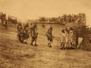

  
[Intangible Textual Heritage](../../../index.md)  [Native
American](../../index)  [Southwest](../index)  [Index](index.md) 
[Next](dg01.md) 

------------------------------------------------------------------------

[Buy this Book at
Amazon.com](https://www.amazon.com/exec/obidos/ASIN/B002DPU0PK/internetsacredte.md)

------------------------------------------------------------------------

  
*Dancing Gods*, by Erna Fergusson, \[1931\], at Intangible Textual
Heritage

------------------------------------------------------------------------

# Dancing Gods

##### INDIAN CEREMONIALS OF NEW MEXICO AND ARIZONA

## by Erna Fergusson

###### \[b. 1888, d. 1964\]

#### Alfred A. Knopf; New York

#### \[1931\]

#### Scanned, proofed and formatted at Intangible Textual Heritage, October 2003, by J. B. Hare. This text is in the public domain because it was not renewed in a timely fashion at the US Copyright Office.

------------------------------------------------------------------------

[Next: Contents](dg01.md)
