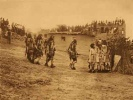

  
[Intangible Textual Heritage](../../../index.md)  [Native
American](../../index)  [Southwest](../index)  [Index](index.md) 
[Previous](dg00)  [Next](dg02.md) 

------------------------------------------------------------------------

[Buy this Book at
Amazon.com](https://www.amazon.com/exec/obidos/ASIN/B002DPU0PK/internetsacredte.md)

------------------------------------------------------------------------

  
*Dancing Gods*, by Erna Fergusson, \[1931\], at Intangible Textual
Heritage

------------------------------------------------------------------------

p. v

# Contents

|                                                   |                          |
|---------------------------------------------------|--------------------------|
| Introduction                                      | [xv](dg02.htm#page_xv.md)   |
| 1: THE PUEBLO PEOPLE                              | [3](dg03.htm#page_3.md)     |
|     THE CLIFF DWELLERS                            | [5](dg03.htm#page_5.md)     |
|     THE WHITE MAN; POPÉ OF SAN JUAN               | [13](dg03.htm#page_13.md)   |
|     THE PUEBLO INDIAN AND THE AMERICAN            | [22](dg03.htm#page_22.md)   |
| II: DANCES OF THE RIO GRANDE PUEBLOS              | [29](dg04.htm#page_29.md)   |
|     WINTER DANCES                                 | [35](dg04.htm#page_35.md)   |
|         The Deer-dance at Taos                    | [36](dg04.htm#page_36.md)   |
|         The Buffalo- and Deer-dance at San Felipe | [40](dg04.htm#page_40.md)   |
|     SPRING DANCES                                 | [44](dg04.htm#page_44.md)   |
|         The Parrot-dance at Santo Domingo         | [45](dg04.htm#page_45.md)   |
|         The Turtle- or Evergreen-dance at Isleta  | [49](dg04.htm#page_49.md)   |
|         The Eagle-dance at Tesuque                | [53](dg04.htm#page_53.md)   |
|     SUMMER AND AUTUMN DANCES                      | [55](dg04.htm#page_55.md)   |
|         The Corn-dance at Santo Domingo           | [56](dg04.htm#page_56.md)   |
|         The Rainbow-dance at Santa Clara          | [60](dg04.htm#page_60.md)   |
|         The Pecos Bull at Jemez                   | [61](dg04.htm#page_61.md)   |
| p. vi                   |                          |
| III: DANCES OF ZUÑI PUEBLO                        | [67](dg05.htm#page_67.md)   |
|     THE SWORD-SWALLOWERS                          | [72](dg05.htm#page_72.md)   |
|      THE SUMMER RAIN-DANCE                        | [86](dg05.htm#page_86.md)   |
|      THE DOLL-DANCE                               | [89](dg05.htm#page_89.md)   |
|      THE SHALAKO                                  | [91](dg05.htm#page_91.md)   |
|      THE LEAVING OF THE GODS                      | [106](dg05.htm#page_106.md) |
| IV: THE HOPIS                                     | [115](dg06.htm#page_115.md) |
|      KATCHINAS                                    | [120](dg06.htm#page_120.md) |
| V: HOPI DANCES                                    | [125](dg07.htm#page_125.md) |
|      THE BEAN-PLANTING CEREMONY                   | [125](dg07.htm#page_125.md) |
|      NIMAN KATCHINA: THE GOING-AWAY OF THE GODS   | [135](dg07.htm#page_135.md) |
|      THE SNAKE LEGEND                             | [145](dg07.htm#page_145.md) |
|      THE SNAKE-DANCE                              | [148](dg07.htm#page_148.md) |
|           Preliminary Ceremonies                  | [148](dg07.htm#page_148.md) |
|           The Antelope-dance                      | [154](dg07.htm#page_154.md) |
|           The Day of the Snake-dance              | [159](dg07.htm#page_159.md) |
|           The Snake-dance                         | [162](dg07.htm#page_162.md) |
|      LALAKONTI, A WOMEN'S CEREMONY                | [168](dg07.htm#page_168.md) |
| VI: THE NAVAJOS                                   | [179](dg08.htm#page_179.md) |
|      "DINNE," THE PEOPLE                          | [179](dg08.htm#page_179.md) |
|      NAVAJOS AND SPAIN                            | [183](dg08.htm#page_183.md) |
|      THE AMERICAN CONQUEST OF THE NAVAJOS         | [185](dg08.htm#page_185.md) |
|      THE BOSQUE REDONDO                           | [189](dg08.htm#page_189.md) |
|      THE RESERVATION AND THE GOVERNMENT           | [190](dg08.htm#page_190.md) |
|      NAVAJO LIFE                                  | [194](dg08.htm#page_194.md) |
|      CEREMONIES                                   | [199](dg08.htm#page_199.md) |
| p. vii                 |                          |
| VII: NAVAJO RELIGION                              | [203](dg09.htm#page_203.md) |
|      MEDICINE-MEN                                 | [203](dg09.htm#page_203.md) |
|      THE SQUAW-DANCE                              | [206](dg09.htm#page_206.md) |
|      THE MOUNTAIN CHANT                           | [208](dg09.htm#page_208.md) |
|           The Legend of the Mountain Chant        | [208](dg09.htm#page_208.md) |
|           Going to the Mountain Chant             | [212](dg09.htm#page_212.md) |
|           Preliminary Ceremonies                  | [215](dg09.htm#page_215.md) |
|           The Ninth Day                           | [218](dg09.htm#page_218.md) |
|           The Last Night                          | [221](dg09.htm#page_221.md) |
|           The Fire-dance                          | [230](dg09.htm#page_230.md) |
|      THE NIGHT CHANT                              | [233](dg09.htm#page_233.md) |
|           The Initiation                          | [235](dg09.htm#page_235.md) |
|           The Last Day                            | [237](dg09.htm#page_237.md) |
|           The Night of Dancing                    | [239](dg09.htm#page_239.md) |
| VIII: THE APACHES                                 | [249](dg10.htm#page_249.md) |
| IX: APACHE DANCES                                 | [257](dg11.htm#page_257.md) |
|      THE MESCALERO APACHE FOURTH OF JULY          | [257](dg11.htm#page_257.md) |
|      THE FOURTH OF JULY                           | [260](dg11.htm#page_260.md) |
|      THE JICARILLA APACHE FIESTA                  | [269](dg11.htm#page_269.md) |
|      INDEX                                        | 277                      |

 

------------------------------------------------------------------------

[Next: Introduction](dg02.md)
