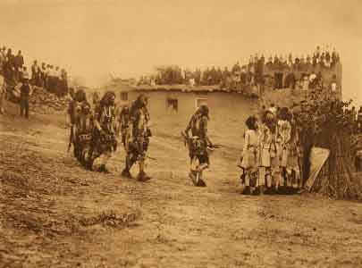

  
[Intangible Textual Heritage](../../../index.md)  [Native
American](../../index)  [Southwest](../index.md) 

------------------------------------------------------------------------

[Buy this Book at
Amazon.com](https://www.amazon.com/exec/obidos/ASIN/B002DPU0PK/internetsacredte.md)

------------------------------------------------------------------------

<table width="75%">
<colgroup>
<col style="width: 50%" />
<col style="width: 50%" />
</colgroup>
<tbody>
<tr class="odd">
<td data-valign="TOP" width="50%"> 
[Hopi] Snake Dancers Entering the Plaza, Edward Curtis, 1921 [Public domain image]</td>
<td data-valign="CENTER" width="50%"><h1 id="dancing-gods" data-align="CENTER">Dancing Gods</h1>
<h5 id="indian-ceremonials-of-new-mexico-and-arizona" data-align="CENTER">Indian Ceremonials of New Mexico and Arizona</h5>
<h2 id="by-erna-fergusson" data-align="CENTER">by Erna Fergusson</h2>
<h4 id="section" data-align="CENTER">[1931]</h4></td>
</tr>
</tbody>
</table>

------------------------------------------------------------------------

[Contents](#contents)    [Start Reading](dg00.md)    [Page
Index](pageidx)    [Text \[Zipped\]](dg.txt.gz.md)

------------------------------------------------------------------------

<table data-align="RIGHT" data-border="2">
<colgroup>
<col style="width: 100%" />
</colgroup>
<tbody>
<tr class="odd">
<td>

<a href="https://www.amazon.com/dp/B002DPU0PK/ref=as_sl_pc_tf_til?tag=internetsacredte&amp;linkCode=w00&amp;linkId=&amp;creativeASIN=B002DPU0PK" id="titlehref">Dancing Gods</a>

<a href="https://www.amazon.com/dp/B002DPU0PK/ref=as_sl_pc_tf_til?tag=internetsacredte&amp;linkCode=w00&amp;linkId=&amp;creativeASIN=B002DPU0PK" id="titlehref">$2.50</a>

<a href="https://www.amazon.com/dp/B002DPU0PK/ref=as_sl_pc_tf_til?tag=internetsacredte&amp;linkCode=w00&amp;linkId=&amp;creativeASIN=B002DPU0PK"></a>

</td>
</tr>
</tbody>
</table>

This is a first person look at a wide range of Pueblo, Hopi, Navajo,
Zuñi, and Apache ceremonials in the late 1920s. This book is both an
ethnographic document and a classic of Southwestern literature.

Erna Fergusson (1888-1964), a native New Mexican, was a talented writer
and journalist. She earned a master's degree in Latin American studies
at Columbia University, and worked for the Red Cross in rural northern
New Mexico. She then worked for the *Albuquerque Tribune*. She founded
Koshare Tours, a pioneering tour of Arizona and New Mexico Native
American ceremonials. This book grew out of that experience.

Fergusson's writing style is spare and vigorous, filled with a sense of
place and a deep appreciation of the desert high plateau region.
*Dancing Gods* is well researched and sympathetic, and remarkably free
of attitudes patronizing or idealizing Native Americans.

------------------------------------------------------------------------

 [Title Page](dg00.md)  
[Contents](dg01.md)  
[Introduction](dg02.md)  
[I. The Pueblo People](dg03.md)  
[II: Dances of the Rio Grande Pueblos](dg04.md)  
[III. Dances of Zuñi Pueblo](dg05.md)  
[IV: The Hopis](dg06.md)  
[V. Hopi Dances](dg07.md)  
[VI: The Navajos](dg08.md)  
[VII: Navajo Dances](dg09.md)  
[VIII: The Apaches](dg10.md)  
[IX: Apache Dances](dg11.md)
