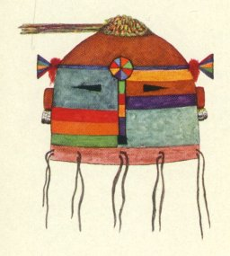

  
[Intangible Textual Heritage](../../../index.md)  [Native
American](../../index)  [Southwest](../index.md) 

------------------------------------------------------------------------

<table width="75%">
<colgroup>
<col style="width: 50%" />
<col style="width: 50%" />
</colgroup>
<tbody>
<tr class="odd">
<td width="50%" data-valign="TOP"> 
</td>
<td width="50%" data-valign="TOP"><h1 id="origin-myth-of-acoma" data-align="CENTER">Origin Myth of Acoma</h1>
<h4 id="and-other-records" data-align="CENTER">and Other Records</h4>
<h2 id="by-matthew-w.-stirling" data-align="CENTER">by Matthew W. Stirling</h2>
<h4 id="section" data-align="CENTER">[1942]</h4>
<h5 id="bureau-of-american-ethnology-bulletin-135" data-align="CENTER">Bureau of American Ethnology Bulletin 135</h5></td>
</tr>
</tbody>
</table>

------------------------------------------------------------------------

[Title Page](oma00.md)  
[Letter of Transmittal](oma01.md)  
[Contents](oma02.md)  
[Illustrations](oma03.md)  
[Text Figures](oma04.md)  
[Preface](oma05.md)  

### Origin Myth

[Origin Myth](oma06.md)  
[Origin of the Evil Spirit](oma07.md)  
[Rule For Tracking Large Game](oma08.md)  
[Fetishes](oma09.md)  
[Wanderings, Part I](oma10.md)  
[Wanderings, Part II](oma11.md)  
[Wanderings, Part III](oma12.md)  
[Wanderings, Part IV](oma13.md)  
[Wanderings, Part V](oma14.md)  
[Wanderings, Part VI](oma15.md)  
[Wanderings, Part VII](oma16.md)  
[Wanderings, Part VIII](oma17.md)  
[Wanderings, Part IX](oma18.md)  
[Wanderings, Part X](oma19.md)  
[Wanderings, Part XI](oma20.md)  
[Wanderings, Part XII](oma21.md)  
[Wanderings, Part XIII](oma22.md)  
[Wanderings, Part XIV](oma23.md)  
[Wanderings, Part XV](oma24.md)  
[Wanderings, Part XVI](oma25.md)  
[Wanderings, Part XVII](oma26.md)  
[Wanderings, Part XVIII](oma27.md)  

 

[The Birth of the War Twins](oma28.md)  

### Present Customs of Acoma

[Selection of Officers](oma29.md)  
[Katsina Initiation](oma30.md)  
[Koshari Initiation](oma31.md)  

 

[Bibliography](oma32.md)  

### Plates

[Explanation of Plates](oma33.md)  
[Plate 1](oma34.md)  
[Plate 2](oma35.md)  
[Plate 3](oma36.md)  
[Plate 4](oma37.md)  
[Plate 5](oma38.md)  
[Plate 6](oma39.md)  
[Plate 7](oma40.md)  
[Plate 8](oma41.md)  
[Plate 9](oma42.md)  
[Plate 10](oma43.md)  
[Plate 11](oma44.md)  
[Plate 12](oma45.md)  
[Plate 13](oma46.md)  
[Plate 14](oma47.md)  
[Plate 15](oma48.md)  
[Plate 16](oma49.md)  
[Plate 17](oma50.md)  
