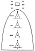

  
[Intangible Textual Heritage](../../../index)  [Native
American](../../index)  [Southwest](../index)  [Index](index) 
[Previous](oma19)  [Next](oma21) 

------------------------------------------------------------------------

### WANDERINGS, PART XI

For a long time it went on thus and all was well. Sometime afterward, a
sickness fell upon the people at White House and for the first time
sickness brought death to many people. The population decreased rapidly.
The chaianyi called this sickness ushporoni. It was a disease with
blisters all over the body (smallpox?). The chaianyi did their best to
cure it, but it was too much for them. The people grew very unhappy, as
they were dying off fast and they did not go through the proper burial
ceremonies. When a person died they just wrapped him up and the family
buried him. The Twins, Masewi and Oyoyewi, were the only ones who did
not get sick. This was probably because of the power of their father.
They tried their power on the sickness, but it did not always work. So
they tried harder and harder each time until they had saved some of
their people and they managed to check the disease.

The Twins had been traveling around a lot and had known other people, so
at this time they thought they would go and learn whether these other
people were sick or not. They went northwest and southeast, all around,
and found many people. None had the sickness. Masewi and Oyoyewi were
much hated by these other people, who did not know them. So they came
back to their people and called a meeting of the Chaianyi, Country
Chief, and Antelope Man. They said

p. 67

to the council, "I guess our mother Iatiku does not want us to live here
any more." They remembered that Iatiku had told them to go on south to
the place known as Haako. "Maybe this sickness is a sign that we should
move on." The council decided that it must be so. So Country Chief said
he would tell the people they were to leave in 4 days, so they would
have time to prepare provisions and make new moccasins and select the
things they would need to take with them. He ordered that nothing
belonging to the religion (altars, masks, etc.) was to be left behind.
All were to help in taking these things along.

 

[  
Click to enlarge](img/06700.jpg)  
FIGURE 4.--Diagram of rite of exorcism.  

 

When the fourth day came, Country Chief told the chaianyi to go on ahead
four lengths (măati'), [49](#fn_148) a long
ways, and to prepare a place to stop. So the chaianyi started. They
dressed up in their official costumes when they made their first stop.
They made a sand painting on the south side of the camp, representing
four mountains ([pl. 15, fig. 1](oma48.htm#img_pl15a)). When the people
came, they were to cross these four mountains and valleys and thus put
the sickness that much more in their

p. 68

rear. All the people that came walked over, stepping on a mountain and
valley in turn. The two chaianyi on the south had their two feathers,
and would brush off the sickness of each person as he approached. The
chaianyi explained how the people were to stop first halfway on the
mountain, then on the top, then in the valley, then halfway up, etc.
(fig. 4). The chaianyi would say, as they brushed them off, "Come,
Raven! You represent the whirlwind, [60](#fn_149) sweep away from us this disease and all
diseases and sadness. You are the one who has the real power to do
this." They would repeat this for each person that approached to cross
the sand painting. Two chaianyi were at the other end of the sand
painting. They were holding two yucca plants cut off at the root and
holding them on the ground as though growing. When the person came over
the fourth mountain, he would spit his sadness into the middle of the
plant. Two other chaianyi were placed at this end where, laid out on the
ground, were yucca leaves tied at the

 

[  
Click to enlarge](img/06800.jpg)  
FIGURE 5.--Frame made of yucca plants, used in rite of exorcism.  

 

four corners (fig. 5). The person steps into the frame. The chaianyi
swing it four times backward and spill out his sickness behind him.

After passing through the frame, they were told to pass on to a high
place where there were two more chaianyi. Before going there they were
to pick up any object that caught their eye, any stick or stone, and
then to brush themselves with the object they had picked up, speaking to
it to take away sickness and sorrow. [61](#fn_150) From there they were allowed to go on.
All the people did the same and the chaianyi buried the objects carrying
the sickness in the hole that had been dug between them. The medicine
men finished their work by destroying the mountains and finally
banishing the sickness. Last of all the chaianyi did all of this to each
other. Then they made four marks on

p. 69

the ground [52](oma21.htm#fn_151) with an
arrowhead, as a barrier to disease, [53](oma21.htm#fn_152) blocking their trail. They
traveled for a long time, slowly, as they were on foot and heavily
burdened. They came to a place they named Wash'pashŭkă (sage
basin). [54](oma21.htm#fn_153) They found water
there and the country was beautiful. So Country Chief said to the
people, "We will stop here for 4 years and make a pueblo; here we will
take along rest." So they made houses with stones and settled down, they
built their kivas, carried on their ceremonies, and lived as before.

------------------------------------------------------------------------

### Footnotes

[67:49](oma20.htm#fr_148) Informant's note:
Maati is the span of thumb and forefinger. Four maati was the old way of
saying "far"; the modern word is teetsa.

[68:60](oma20.htm#fr_149) Probably
ha·'yactc’ιTcunyi hα'tc‘tcTse, Whirlwind old man (cf. Boas,
1928, pt. 2, p. 190, ll. 19, 26).

[68:61](oma20.htm#fr_150) This is the rite
observed by other Pueblos and by Navaho on a journey. It is South
American practice also. There, among Andean peoples, the sticks or
stones are left in a pile.

------------------------------------------------------------------------

[Next: Wanderings, Part XII](oma21)
