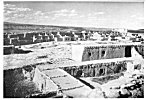

  
[Intangible Textual Heritage](../../../index.md)  [Native
American](../../index)  [Southwest](../index)  [Index](index.md) 
[Previous](oma34)  [Next](oma36.md) 

------------------------------------------------------------------------

### PLATE 2

[  
Click to enlarge](img/pl02.jpg.md)  
Plate 2  

Acoma, viewed from the roof of the Convento.

------------------------------------------------------------------------

[Next: Plate 3](oma36.md)
