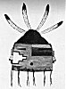
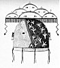

  
[Intangible Textual Heritage](../../../index)  [Native
American](../../index)  [Southwest](../index)  [Index](index) 
[Previous](oma38)  [Next](oma40) 

------------------------------------------------------------------------

### PLATE 6

[  
Click to enlarge](img/pl06a.jpg)  
Plate 6, Figure 1  

FIGURE 1. Nawish katsina. Eagle feathers (white with black tips);
parrot-feather topknot (green and red); forehead brown edged with blue
yarn; face painted with colors of the directions: orange (background of
face), the earth, yellow (stripe at upper right), the Sun; green (center
stripe at right), water; blue (lower stripe at right), the sky. The
terraced design (white edged with red) represents a field; red yam
around mouth; lower edge of mask with thongs for fastening, brown. A
spruce collar will be worn.

[  
Click to enlarge](img/pl06b.jpg)  
Plate 6, Figure 2  

FIGURE 2. Kopishtaiya. No special name; referred to merely as "the one
who carries clouds on his head." Hennati, cumulus clouds (white with
triangular black marks and edged with red with dependent black lines);
black horizontal

p. 120

line is wakaianish, the black line under the clouds when it is about to
rain; the black vertical lines are rain; lightnings (red); blue (right
side of mask) for sky; yellow (left side) for earth; turkey tracks
(white); diagonal line and short line joining it (red); lower edge of
mask red with brown thongs for fastening. Turkey feathers (black and
white) in ears; eagle-down feathers on the Clouds (shi'wana).

------------------------------------------------------------------------

[Next: Plate 7](oma40)
