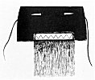

  
[Intangible Textual Heritage](../../../index.md)  [Native
American](../../index)  [Southwest](../index)  [Index](index.md) 
[Previous](oma39)  [Next](oma41.md) 

------------------------------------------------------------------------

### PLATE 7

[  
Click to enlarge](img/pl07a.jpg.md)  
Plate 7, Figure 1  

FIGURE 1. Chakoya katsina. Mask black bordered with brown; eye-slits
yellow; blue feathers from duck head around the mouth; teeth of corn
husks; beard of human hair. A skirt of an entire buckskin hanging almost
to the feet will be worn.

[  
Click to enlarge](img/pl07b.jpg.md)  
Plate 7, Figure 2  

FIGURE 2. Shumaashka, Corn clan katsina. Squash blossom (red) on side;
horn frame (green) strung with cotton; blue (left side of mask) for sky;
yellow (right side) for earth; median line represents a 4-day trail with
black and white for night and day; sash collar (white) with pendant
ornaments (blue and red).

------------------------------------------------------------------------

[Next: Plate 8](oma41.md)
