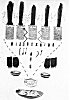
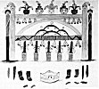

  
[Intangible Textual Heritage](../../../index)  [Native
American](../../index)  [Southwest](../index)  [Index](index) 
[Previous](oma40)  [Next](oma42) 

------------------------------------------------------------------------

### PLATE 8

[  
Click to enlarge](img/pl08a.jpg)  
Plate 8, Figure 1  

FIGURE 1. Hunters' society altar. Five honani (see footnote
 [80](oma11.htm#fn_79), p. 31); two lightnings (right, yellow; left,
red) (the power for killing game: yellow, north lightning; red, south
lightning); fetiches of carnivorous animals; down the center is the
hiamuni (corn meal road) which the animals follow to go out; two pairs
of mapani (left bear paws, black); bows, arrows, rabbit sticks (brown);
bowls of sacred corn meal (orange with white bands); medicine bowl
(white with tan design); basket (brown) of prayer sticks (white
feathers, variously colored sticks). The tracks (black) of the
road-runner are made so the rabbits won't know which way the hunter is
heading.

[  
Click to enlarge](img/pl08b.jpg)  
Plate 8, Figure 2  

FIGURE 2. Fire society altar. The frame (green), ichini, is the house of
everything on the altar; on right end, Masewi (face yellow; hair black;
three feathers white; body brown and black; diagonal twisted rope
white); on left end, Oyoyewi (face blue, otherwise coloring same as
Masewi); the arc (buff) is the Milky Way; over it the middle figure is
Iatiku (yellow face, 3-lobed tan headdress, feathers white); on each
side Kuishanako, Blue women (blue faces; forehead white with curved
black stripe; headdresses, green triangle in stepped black design topped
with white feather); the next two are Kuganinako, Red women (red faces;
headdress, orange triangle surmounted by green ball; black petals on
either side suggest fleur-de-lis; feathers, white); the two end ones
(tall) are Kochininako, Yellow women (faces tan, body and headdress
green, feather white). (These women are the mothers of the first-born
girls, clan mothers, the first to be born after Iatiku.) The feathers
(white, black-tipped) from the horizontal bar represent rain; under the
Clouds (white, rims red fringed with black, feathers white) the lines
and the suspended feathers (white, black-tipped) also represent rain; at
each end, lightning (red); the five corn fetishes at the bottom are
honani (Iatiku) (see footnote  [80](oma11.htm#fn_79), p. 31); in front,
the medicine bowl (white with tan design; inside white with yellow
border); on each side, left paws of bears (black) and stone points
(gray, brown) used for killing; in front, stone fetishes (black, gray,
brown) of Bear, Lion, Wolf. etc.

------------------------------------------------------------------------

[Next: Plate 9](oma42)
