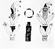

  
[Intangible Textual Heritage](../../../index)  [Native
American](../../index)  [Southwest](../index)  [Index](index) 
[Previous](oma41)  [Next](oma43) 

------------------------------------------------------------------------

### PLATE 9

[  
Click to enlarge](img/pl09a.jpg)  
Plate 9, Figure 1  

FIGURE 1. Katsina prayer sticks. Made of willow (a "water" tree); the
bark is left on and the lower part (brown) represents legs; measured
from base of palm to tip of middle finger (about 7 inches); turkey
feathers (white), on top eagle down; the faces are painted in the colors
of the directions (from left to right--1st, dark green; 2nd, red; 3d,
yellow; 4th, light green); section below faces

p. 121

painted blue for sky and represents the body; top pieces: two (1st,
yellow; 2nd, white with tan decoration) represent a jar; two (tan), a
mountain.

[  
Click to enlarge](img/pl09b.jpg)  
Plate 9, Figure 2  

FIGURE 2. Fire society prayer sticks. Upper center: Basket ring
(maskuch) to put on the head for Iatiku to use; it is painted with the
colors (diagonal bands of red, white, yellow, blue) of the Mountains of
the four directions. Lower center: The prayer stick (blue, with green
and yellow top) represents Iatiku, with belt (green) and pot rest, the
two things she asked for; the befeathered sticks (brown; sections
between feathers, green; scalloped design at base, white) the chaianyi
decided of themselves to offer; the cones (left, green and brown; right,
black and yellow) on top represent mountains; the turkey feathers
(white) are the clothes (whenever things are tied to a stick, they are
clothes).

------------------------------------------------------------------------

[Next: Plate 10](oma43)
