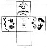
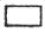
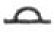
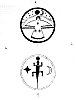

  
[Intangible Textual Heritage](../../../index)  [Native
American](../../index)  [Southwest](../index)  [Index](index) 
[Previous](oma42)  [Next](oma44) 

------------------------------------------------------------------------

### PLATE 10

[  
Click to enlarge](img/pl10a.jpg)  
Plate 10, Figure 1  

FIGURE 1. Kiva floor and murals. Central panel shows floor with medicine
men (X X X) sitting behind altar, with shipapu kuwatsaishuma (O),
medicine bowl ( ),
tsiwaimitiima ( ),
fireplace ( ), ladders
( ). *North wall*: Flint
bird (white with black and brown dots, legs and tail brown), Clouds
(upper three, white; lower three, orange, blue, red) and lightning (red)
over field (orange). *West wall*: Water snake (brown) (killed by the
Twins), Tsitsanits katsina (half blue, half black; forehead black
divided by red triangle, horns green), Oshach katsina (blue face, green
forehead, feather top piece); star (brown). *South wall* always left
blank. *East wall*: Bears (left, black; right, brown) (note hearts, also
two shamanistic eagle feathers in left paw); Kopishtaiya, Sun (red, with
black "rays"); Kopishtaiya katsina (see pl. 5, fig. 2); Tsiukiri katsina
(see pl. 3, fig. 2). People sit in an are around south, southeast, and
southwest walls.

[  
Click to enlarge](img/pl10b.jpg)  
Plate 10, Figure 2  

FIGURE 2. Altar sand paintings. *a*, Fire society altar: The rim (blue)
is the sky; the upper crescent contains the symbols for the sun (red),
moon (yellow), and stars; the arc (pale gray) is the Milky Way; the face
(yellow with black hair) below, Iatiku; and the spots (yellow) represent
the earth; the triangular object (red) on breast is the heart, the
center of the earth and the center of the picture. b, Ant society altar:
Circle (pale gray) and spots (yellow) are of corn meal; star, blue; sun,
red; moon, yellow. The lizard (green with 4 bands--yellow, blue, red,
white--around throat) can eat ants and gives power to cure a person
afflicted with itching caused by ants.

------------------------------------------------------------------------

[Next: Plate 11](oma44)
