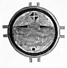
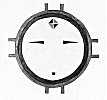

  
[Intangible Textual Heritage](../../../index.md)  [Native
American](../../index)  [Southwest](../index)  [Index](index.md) 
[Previous](oma43)  [Next](oma45.md) 

------------------------------------------------------------------------

### PLATE 11

Sun and Moon paintings (These figures are used in sand painting or on
kiva wall to get power from Sun and Moon.)

[  
Click to enlarge](img/pl11a.jpg.md)  
Plate 11, Figure 1  

FIGURE 1. The Sun. The face is red because the Sun is male and the giver
of strong light; ornament on forehead (brown and black triangles,
divided by white line) represents a squash blossom; two outer rims are
green and orange; projections (orange) represent beams of light.

[  
Click to enlarge](img/pl11b.jpg.md)  
Plate 11, Figure 2  

FIGURE 2. The Moon. The face is yellow because the Moon is female, and
the light is pale; the two outer rims (green and red) are the "ring
about the moon"; ornament (brown and black triangles, divided by white
line) represents a squash blossom.

------------------------------------------------------------------------

[Next: Plate 12](oma45.md)
