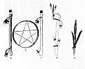
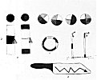

  
[Intangible Textual Heritage](../../../index)  [Native
American](../../index)  [Southwest](../index)  [Index](index) 
[Previous](oma46)  [Next](oma48) 

------------------------------------------------------------------------

### PLATE 14

[  
Click to enlarge](img/pl14a.jpg)  
Plate 14, Figure 1  

FIGURE 1. Prayer sticks used by Kopishtaiya, also Antelope clan staff.
*a*, Trail (hiamuni) prayer stick (gray and blue). It opens the trail;
it is laid so that the head faces the pueblo. The Kopishtaiya use it in
entering the pueblo. *b*, Shield (haiitsi) of Kopishtaiya, a hoop
(brown) with cotton string (black) fastened like a star. *c*, Staff
(yapi) (pink) the Antelope clan use in the drama of the katsina war,
willow (see [p. 72](oma22.htm#page_72)). *d*, Used as a cane (gray) by
Tsiukiri, Kopishtaiya chief. Turkey feathers at tip of crook (white),
eagle and parrot feathers. *e*, This hiatsimuh prayer stick (brown,
feathers red) laid by the Kopishtaiya against corners of houses and
cliffs to keep them from falling. Hard wood. Four of these are used at a
time. The paint iakatcha (manly paint) they get from Hopi. Faces above
*a* and *c* green.

[  
Click to enlarge](img/pl14b.jpg)  
Plate 14, Figure 2  

FIGURE 2. Miniature ritual implements. *a*, Kick sticks (black and
white) with prayer feathers: about 4 inches; face (green) of the katsina
summer cloud ruler on ends. *b*, Tokia moti. Colors on the
balls (quartered in red, blue, yellow, white) are for the four
directions; the paddle is black (handle) for night, yellow (blade) for
earth, red for lightning (on blade); miniature goal stakes (white and
black). c, Miniature pot rest (blue, yellow, red alternating with black)
for Iatiku.

------------------------------------------------------------------------

[Next: Plate 15](oma48)
