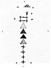
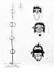

  
[Intangible Textual Heritage](../../../index)  [Native
American](../../index)  [Southwest](../index)  [Index](index) 
[Previous](oma47)  [Next](oma49) 

------------------------------------------------------------------------

### PLATE 15

[  
Click to enlarge](img/pl15a.jpg)  
Plate 15, Figure 1  

FIGURE 1. Sand painting and paraphernalia for exorcism (gray, red, blue,
and yellow triangles; green crosses, frame, and grasses).

[  
Click to enlarge](img/pl15b.jpg)  
Plate 15, Figure 2  

FIGURE 2. *a*, Face paintings of the dead. 1, Woman (face yellow, red
spots on either cheek, necklace coral). 2. Man (face brown). 3, Chaianyi
(forehead tan, mask black, lower part of face grey; clan necklace black
and abalone pendant gray). *b*, Groove in rock for rite of forgetting
the dead.

------------------------------------------------------------------------

[Next: Plate 16](oma49)
