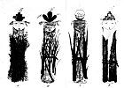

  
[Intangible Textual Heritage](../../../index)  [Native
American](../../index)  [Southwest](../index)  [Index](index) 
[Previous](oma49) 

------------------------------------------------------------------------

### PLATE 17

[  
Click to enlarge](img/pl17.jpg)  
Plate 17  

Prayer sticks for the Mountains of the four directions.

N: Spruce wood (brown; face yellow) and twigs; headdress (center black,
outlined in green, sides red, top edged with green), symbol of snow for
winter. *W*: Pine (brown; face blue); o’kai reeds (green) from early
spring water plant; headdress (center lobe black, side lobes green),
symbol of early leaves for spring. *S*: Fir(?) (brown, face red);
cattail leaves (green); headdress, symbol of jar, clouds (face, white)
and water (green) for summer. *E*: Aspen (gray, face white); corn leaves
(green) ("the clothes"); headdress, symbol of field (red terrace
outlined in black; lightning symbol in black) for fall. Turkey feathers
at ears of all four prayer sticks; eagle down at top.
