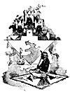

  
[Intangible Textual Heritage](../../../index)  [Native
American](../../index)  [Southwest](../index)  [Index](index) 
[Next](pifs01) 

------------------------------------------------------------------------

# PUEBLO INDIAN FOLK-STORIES

##### BY

## CHARLES F. LUMMIS

#### New York: Century Co.,

#### 1910

###### Scanned at Intangible Textual Heritage, December 2003. J. B. Hare, redactor. This text is in the public domain. These files may be used for any non-commercial purpose, provided this notice of attribution is left intact.

[  
Click to enlarge](img/front.jpg)  
THE BOY IN THE HOUSE OF THE TRUES (SEE PAGE 115.)  

TO  
THE FAIRY TALE THAT CAME TRUE IN  
THE HOME OF THE TÉE-WAHN  
MY WIFE AND CHILD

 

------------------------------------------------------------------------

[Next: Contents](pifs01)
