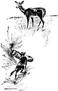
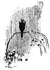

  
[Intangible Textual Heritage](../../../index)  [Native
American](../../index)  [Southwest](../index)  [Index](index) 
[Previous](pifs03)  [Next](pifs05) 

------------------------------------------------------------------------

p. 12

# I

### THE ANTELOPE BOY

ONCE upon a time there were two towns of the Tée-wahn, called
Nah-bah-tóo-too-ee (white village) and Nah-choo-rée-too-ee (yellow
village). A man of Nah-bah-tóo-too-ee and his wife were attacked by
Apaches while out on the plains one day, and took refuge in a cave,
where they were besieged. And there a boy was born to them. The father
was killed in an attempt to return to his village for help; and
starvation finally forced the mother to crawl forth by night seeking
roots to eat. Chased by the Apaches, she escaped to her own village, and
it was several days before she could return to the cave-only to find it
empty.

The baby had begun to cry soon after her departure. just then a
Coyote [1](#fn_4) was passing, and heard. Taking
pity on the child, he picked it up and carried it across the plain until
he came to a herd of antelopes. Among them was a Mother-Antelope that
had lost her fawn; and going to her the Coyote said:

"Here is an *ah-bóo* (poor thing) that is left by its people. Will you
take care of it?

p. 13

The Mother-Antelope, remembering her own baby, with tears said "Yes,"
and at once adopted the tiny stranger, while the Coyote thanked her and
went home.

So the boy became as one of the antelopes, and grew up among them until
he was about twelve years old. Then it happened that a hunter came out
from Nah-bah-tóo-too-ee for antelopes, and found this herd. Stalking
them carefully, he shot one with an arrow. The rest started off, running
like the wind; but ahead of them all, as long as they were in sight, he
saw a boy! The hunter was much surprised, and, shouldering his game,
walked back to the village, deep in thought. Here he told the
Cacique [1](#fn_5) what he had seen. Next day the
crier was sent out to call upon all the people to prepare for a great
hunt, in four days, to capture the Indian boy who lived with the
antelopes.

While preparations were going on in the village, the antelopes in some
way heard of the intended hunt and its purpose. The Mother-Antelope was
very sad when she heard it, and at first would say nothing, But at last
she called her adopted son to her an said: "Son, you have heard that the
people of Nah-bah-tóo-too-ee are coming to hunt. But they will not kill
us; all they wish is to take you. They will surround us, intending to
let all the antelopes escape from the circle. You must follow me where I
break through the line, and your real mother will be coming on the
northeast side in a white *manta* (robe). I will pass close to her, and
you must stagger and fall where she can catch you."

p. 14

On the fourth day all the people went out upon the plains. They found
and surrounded the herd of antelopes, which ran about in a circle when
the hunters closed upon them. The circle grew smaller, and the antelopes
began to break through; but the hunters paid no attention to them,
keeping their eyes upon the boy. At last he and his antelope mother were
the only ones left, and when she broke through the line on the northeast
he followed her and fell at the feet of his own human mother, who sprang
forward and clasped him in her arms.

Amid great rejoicing he was taken to Nah-bah-tóo-too-ee, and there he
told the *principales* [1](#fn_6) how he had been
left in the cave, how the Coyote had pitied him, and how the
Mother-Antelope had reared him as her own son.

It was not long before all the country round about heard of the Antelope
Boy and of his marvelous fleetness of foot. You must know that the
antelopes never comb their hair, and while among them the boy's head had
grown very bushy. So the people called him *Pée-hleh-o-wah-wée-deh*
(big-headed little boy).

Among the other villages that heard of his prowess was
Nah-choo-rée-too-ee , all of whose people "had the bad road." [2](#fn_7) They had a wonderful runner named
*Pée-k'hoo* (Deer-foot), and very soon they sent a challenge to
Nah-bah-tóo-too-ee for a championship race. Four days were to be given
for preparation, to make bets, and the like.\[paragraph continues\]

p. 15

 

[  
Click to enlarge](img/01500.jpg)  
THE COYOTE CARRIES THE BABY TO THE ANTELOPE MOTHER.  

 

p. 17

The race was to be around the world. [1](#fn_8)
Each village was to stake all its property and the lives of all its
people on the result of the race. So powerful were the witches of
Nah-choo-rée-too-ee that they felt safe in proposing so serious a stake;
and the people of Nah-bah-tóo-too-ee were ashamed to decline the
challenge.

The day came, and the starting-point was surrounded by all the people of
the two villages, dressed in their best. On each side were huge piles of
ornaments and dresses, stores of grain, and all the other property of
the people. The runner for the yellow village was a tall, sinewy
athlete, strong in his early manhood; and when the Antelope Boy appeared
for the other side, the witches set up a howl of derision, and began to
strike their rivals and jeer at them, saying, "Poch! We might as well
begin to kill you now! What can that *óo-deh* (little thing) do?"

 

At the word "*Hái-ko*!" ("Go!") the two runners started toward the east
like the wind. The Antelope Boy soon forged ahead; but Deer-foot, by his
witchcraft, changed himself into a hawk and flew lightly over the lad,
saying, "*We* do this way to each other!" [2](#fn_9) The Antelope Boy kept running, but his heart
was very heavy, for he knew that no feet could equal the swift flight of
the hawk.

p. 18

But just as he came half-way to the east, a Mole came up from its burrow
and said:

"My son, where are you going so fast with a sad face?"

The lad explained that the race was for the

[  
Click to enlarge](img/01800.jpg)  
RAIN FALLS ON PÉE-K'HOO.  

property and lives of all his people; and that the witch-runner had
turned to a hawk and left him far behind.

p. 19

"Then, my son," said the Mole, "I will be he that shall help you. Only
sit down here a little while, and I will give you something to carry."

The boy sat down, and the Mole dived into the hole, but soon came back
with four cigarettes. [1](#fn_10)

Holding them out, the Mole said, "Now, my son, when you have reached the
east and turned north, smoke one; when you have reached the north and
turn west, smoke another; when you turn south, another, and when you
turn east again, another. *Hái-ko*!"

The boy ran on, and soon reached the east. Turning his face to the north
he smoked the first cigarette. No sooner was it finished than he became
a young antelope; and at the same instant a furious rain began.
Refreshed by the cool drops, he started like an arrow from the bow.
Half-way to the north he came to a large tree; and there sat the hawk,
drenched and chilled, unable to fly, and crying piteously.

"Now, friend, *we* too do this to each other," called the boy-antelope
as he dashed past. But just as he reached the north, the hawk--which had
become dry after the short rain--caught up and passed him, saying, "We
too do this to each other!" The boy-antelope turned westward, and smoked
the second cigarette; and at once another terrific rain began. [2](#fn_11) Half-way to the west he again passed the
hawk shivering and crying in a tree,

p. 20

and unable to fly; but as he was about to turn to the south, the hawk
passed him with the customary taunt. The smoking of the third cigarette
brought another storm, and again the antelope passed the wet hawk
half-way, and again the hawk dried its feathers in time to catch up and
pass him as he was turning to the east for the home-stretch. Here again
the boy-antelope stopped and smoked a cigarette--the fourth and last.
Again a short,

[  
Click to enlarge](img/02000.jpg)  
''THE TWO RUNNERS CAME SWEEPING DOWN THE HOME-STRETCH, STRAINING EVERY
NERVE.''  

hard rain came, and again he passed the water-bound hawk half-way.

Knowing the witchcraft of their neighbors, the people of
Nah-bah-tóo-too-ee had made the condition that, in whatever shape the
racers might run the rest of the course, they must resume human form
upon arrival at a certain hill upon the fourth turn, which was in sight
of the goal. The last wetting of the hawk's feathers delayed it so that
the antelope reached the hill just ahead; and there, resuming their
natural shapes, the two runners came

p. 21

sweeping down the home-stretch, straining every nerve. But the Antelope
Boy gained at each stride. When they saw him, the witch-people felt
confident that he was their champion, and again began to push, and
taunt, and jeer at the others. But when the little Antelope Boy sprang
lightly across the line, far ahead of Deer-foot, their joy turned to
mourning.

The people of Nah-bah-tóo-too-ee burned all the witches upon the spot,
in a great pile of corn; but somehow one escaped, and from him come all
the witches that trouble us to this day.

The property of the witches was taken to Nah-bah-tóo-too-ee; and as it
was more than that village could hold, the surplus was sent to
Shee-eh-whíb-bak (Isleta), where we enjoy it to this day; and later the
people themselves moved here. And even now, when we dig in that little
hill on the other side of the *charco* (pool), we find charred
corn-cobs, where our forefathers burned the witch-people of the yellow
village.

During Lorenso's story the black eyes of the boys have never left his
face; and at every pause they have made the customary response, "Is that
so?" to show their attention; while the old men have nodded approbation,
and smoked in deep silence.

Now Lorenso turns to Desiderio, [1](#fn_12) who
is far more wrinkled even than he, and says, "You have a tail, brother."
And Desiderio, clearing his throat and making a new cigarette with great
impressiveness, begins: "My sons, do you know why the Coyote and the
Crows are always at war? No? Then I will tell you."

------------------------------------------------------------------------

### Footnotes

[12:1](pifs04.htm#fr_4) The small prairie-wolf.

[13:1](pifs04.htm#fr_5) The highest religious
official.

[14:1](pifs04.htm#fr_6) The old men who are the
congress of the pueblo.

[14:2](pifs04.htm#fr_7) That is, were witches.

[17:1](pifs04.htm#fr_8) The Pueblos believed it
was an immense plain whereon the racers were to race over a square
course--to the extreme east, then to the extreme north, and so on, back
to the starting-point.

[17:2](pifs04.htm#fr_9) A common Indian taunt,
either good-natured or bitter, to the loser of a game or to a conquered
enemy.

[19:1](pifs04.htm#fr_10) These are made by
putting a certain weed called *pee-én-hleh* into hollow reeds.

[19:2](pifs04.htm#fr_11) I should state, by the
way, that the cigarette plays an important part in the Pueblo
folk-stories,--they never had the pipe of the Northern Indians,--and all
rain-clouds are supposed to come from its smoke.

[21:1](pifs04.htm#fr_12) Pronounced
Day-see-dáy-ree-oh.

------------------------------------------------------------------------

[Next: II. The Coyote and the Crows](pifs05)
