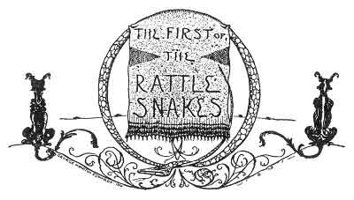
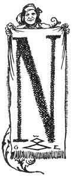
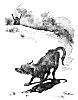

  
[Intangible Textual Heritage](../../../index.md)  [Native
American](../../index)  [Southwest](../index)  [Index](index.md) 
[Previous](pifs08)  [Next](pifs10.md) 

------------------------------------------------------------------------

p. 34

# VI

 

### The First of the Rattlesnakes

|                    |
|--------------------|
|  |

OW there is a tail to you, *compadre* \[friend\]," said old Desiderio,
nodding at Patricio [1](#fn_17.md) after we had sat
awhile in silence around the crackling fire.

Patricio had a broad strip of rawhide across his knee, and was scraping
the hair from it with a dull knife. It was high time to be thinking of
new soles, for already there was a wee hole in the bottom of each of his
moccasins; and as for Benito, his shy little grandson, *his* toes were
all abroad.

But shrilly as the cold night-wind outside hinted the wisdom of speedy
cobbling, Patricio had no wish

p. 35

to acquire that burro's tail, so, laying the rawhide and knife upon the
floor beside him, he deliberately rolled a modest pinch of the aromatic
*koo-ah-rée* in a corn-husk, lighted it at the coals, and drew Benito's
tousled head to his side.

"You have heard," he said, with a slow puff, about Nah-chu-rú-chu, the
mighty medicine-man who lived here in Isleta in the times of the
ancients?"

"*Ah-h*!" (Yes) cried all the boys. "You have promised to tell us how he
married the moon!"

"Another time I will do so. But now I shall tell you something that was
before that--for Nah-chu-rú-chu had many strange adventures before he
married Páh-hlee-oh, the Moon-Mother. Do you know why the
rattlesnake--which is the king of all snakes and alone has the power of
death in his mouth-always shakes his *guaje* [1](#fn_18.md) before he bites?"

"*Een-dah*!" chorused Ramon and Benito, and Fat Juan, and Tomas, [2](#fn_19.md) very eagerly; for they were particularly
fond of hearing about the exploits of the greatest of Tée-wahn
medicine-men.

"Listen, then, and you shall hear."

 

In those days Nah-chu-rú-chu had a friend who lived in a pueblo nearer
the foot of the Eagle-Feather Mountain than this, in the Place of the
Red Earth, where still are its ruins; and the two young men went often
to the mountain together to bring wood and to hunt. Now, Nah-chu-rú-chu

p. 36

had a white heart, and never thought ill; but the friend had the evil
road and became jealous, for Nah-chu-rú-chu was a better hunter. But he
said nothing, and made as if he still loved Nah-chu-rú-chu truly.

One day the friend came over from his village and said:

"Friend Nah-chu-rú-chu, let us go to-morrow for wood and to have a hunt.

"It is well," replied Nah-chu-rú-chu. Next morning he started very early
and came to the village of his friend; and together they went to the
mountain. When they had gathered much wood, and lashed it in bundles for
carrying, they started off in opposite directions to hunt. In a short
time each returned with a fine fat deer.

"But why should we hasten to go home, friend Nah-chu-rú-chu?" said the
friend. "It is still early, and we have much time. Come, let us stop
here and amuse ourselves with a game."

"It is well, friend," answered Nah-chu-rú-chu; "but what game shall we
play? For we have neither *pa-toles*, nor hoops, nor any other game
here."

"See! we will roll the *mah-khúr*, [1](#fn_20.md)
for while I was waiting for you I made one that we might play"--and the
false friend drew from beneath his blanket a pretty painted hoop; but
really he had

p. 37

 

[  
Click to enlarge](img/03700.jpg.md)  
''AS HE CAUGHT THE HOOP HE WAS INSTANTLY CHANGED INTO A POOR COYOTE!''  

 

p. 39

made it at home, and had brought it hidden, on purpose to do harm to
Nah-chu-rú-chu.

"Now go down there and catch it when I roll it," said he; and
Nah-chu-rú-chu did so. But as he caught the hoop when it came rolling,
he was no longer Nah-chu-rú-chu the brave hunter, but a poor Coyote with
great tears rolling down his nose!

"Hu!" said the false friend, tauntingly, "we do this to each other! So
now you have all the plains to wander over, to the north, and west, and
south; but you can never go to the east. And if you are not lucky, the
dogs will tear you; but if you are lucky, they may have pity on you. So
now good-by, for this is the last I shall ever see of you."

Then the false friend went away, laughing, to his village; and the poor
Coyote wandered aimlessly, weeping to think that he had been betrayed by
the one he had loved and trusted as a brother. For four days he prowled
about the outskirts of Isleta, looking wistfully at his home. The fierce
dogs ran out to tear him; but when they came near they only sniffed at
him, and went away without hurting him. He could find nothing to eat
save dry bones, and old thongs or soles of moccasins.

On the fourth day he turned westward, and wandered until he came to
Mesita. [1](#fn_21.md) There was no town of the
Lagunas there then, and only a shepherd's hut and corral, in which were
an old Quères Indian and his grandson, tending their goats.

Next morning when the grandson went out very early to let the goats from
the corral, he saw a Coyote run out from among the goats. It went

p. 40

off a little way, and then sat down and watched him. The boy counted the
goats, and none were missing, and he thought it strange. But he said
nothing to his grandfather.

For three more mornings the very same thing happened; and on the fourth
morning the boy told his grandfather. The old man came out, and set the
dogs after the Coyote, which was sitting a little way off; but when they
came near they would not touch him.

"I suspect there is something wrong here," said the old shepherd; and he
called: "Coyote, are you coyote-true, or are you people?"

But the Coyote could not answer; and the old man called again: "Coyote,
are you people?"

At that the Coyote nodded his head, "Yes."

"If that is so, come here and be not afraid of us; for we will be the
ones to help you out of this trouble."

So the Coyote came to them and licked their hands, and they gave it
food--for it was dying of hunger. When it was fed, the old man said:

"Now, son, you are going out with the goats along the creek, and there
you will see some willows. With your mind look at two willows, and mark
them; and to-morrow morning you must go and bring one of them."

The boy went away tending the goats, and the Coyote stayed with the old
man. Next morning, when they awoke very early, they saw all the earth
wrapped in a white *manta*. [1](#fn_22.md)

p. 41

 

[  
Click to enlarge](img/04100.jpg.md)  
''COYOTE, ARE YOU PEOPLE?''  

 

p. 43

"Now, son," said the old man, "you must wear only your moccasins and
breech-clout, and go like a man to the two willows you marked yesterday.
To one of them you must pray; and then cut the other and bring it to
me."

The boy did so and came back with the willow stick. The old man prayed,
and made a *mah-khúr* hoop; and bidding the Coyote stand a little way
off and stick his head through the hoop before it should stop rolling,
rolled it toward him. The Coyote waited till the hoop came very close,
and gave a great jump and put his head through it before it could stop.
And lo! there stood Nah-chu-rú-chu, young and handsome as ever; but his
beautiful suit of fringed buckskin was all in rags. For four days he
stayed there and was cleansed with the cleansing of the medicine-man;
and then the old shepherd said to him:

"Now, friend Nah-chu-rú-chu, there is a road. [1](#fn_23.md) But take with you this *faja*, [2](#fn_24.md) for though your power is great, you have
submitted to this evil. When you get home, he who did this to you will
be first to know, and he will come pretending to be your friend, as if
he had done nothing; and he will ask you to go hunting again. So you
must go; and when you come to the mountain, with this *faja* you shall
repay him."

Nah-chu-rú-chu thanked the kind old shepherd, and started home. But when
he came to the Bad Hill and looked down into the valley of the Rio
Grande, his heart sank. All the grass and

p. 44

fields and trees were dry and dead--for Nah-chu-rú-chu was the
medicine-man who controlled the clouds, so no rain could fall when he
was gone; and the eight days he had been a Coyote were in truth eight
years. The river was dry, and the springs; and many of the people were
dead from thirst, and the rest were dying. But as Nah-chu-rú-chu came
down the hill, it began to rain again, and all the people were glad.

When he came into the pueblo, all the famishing people came out to
welcome him. And soon came the false friend, making as if he had never
bewitched him nor had known whither he disappeared.

In a few days the false friend came again to propose a hunt; and next
morning they went to the mountain together. Nah-chu-rú-chu had the
pretty *faja* wound around his waist; and when the wind blew his blanket
aside, the other saw it.

"Ay! What a pretty *faja*!" cried the false friend. "Give it to me,
friend Nah-chu-rú-chu."

"*Een-dah*!" (No) said "Nah-chu-rú-chu. But the false friend begged so
hard that at last he said:

"Then I will roll it to you; and if you can catch it before it unwinds,
you may have it."

So he wound it up, [1](#fn_25.md) and holding by
one end gave it a push so that it ran away from him, unrolling as it
went. The false friend jumped for it, but it was unrolled before he
caught it-

"*Een-dah*!" said Nah-chu-rú-chu, pulling it back. "If you do not care
enough for it to be spryer than that, you cannot have it."

p. 45

 

[  
Click to enlarge](img/04500.jpg.md)  
''AS HE SEIZED IT HE WAS CHANGED FROM A TALL YOUNG MAN INTO A GREAT
RATTLESNAKE.''  

 

p. 47

The false friend begged for another trial; so Nah-chu-rú-chu rolled it
again. This time the false friend caught it before it was unrolled; and
lo! instead of a tall young man, there lay a great rattlesnake with
tears rolling from his lidless eyes!

"We, too, do this to each other!" said Nah-chu-rú-chu. He took from his
medicine-pouch a pinch of the sacred meal and laid it on the snake's
flat head for its food; and then a pinch of the corn-pollen to tame
it. [1](#fn_26.md) And the snake ran out its red
forked tongue, and licked them.

"Now," said Nah-chu-rú-chu, "this mountain and all rocky places shall be
your home. But you can never again do to another harm, without warning,
as you did to me. For see, there is a *guaje* [2](#fn_27.md) in your tail, and whenever you would do
any one an injury, you must warn them beforehand with your rattle."

"And is that the reason why Ch'ah-rah-ráh-deh always rattles to give
warning before he bites?" asked Fat Juan, who is now quite as often
called Juan Biscocho (John Biscuit), since I photographed him one day
crawling out of the big adobe bake-oven where he had been hiding.

"That is the very reason. Then Nah-chu-rú-chu left his false friend,
from whom all the rattlesnakes are descended, and came back to his
village. From that time all went well with Isleta, for Nah-chu-rú-chu
was at home again to attend to the clouds. There was plenty of rain, and
the river began to run again, and the springs flowed.\[paragraph
continues\]

p. 48

The people plowed and planted again, as they had not been able to do for
several years, and all their work prospered. As for the people who lived
in the Place of the Red Earth, they all moved down here, [1](#fn_28.md) because the Apaches were very bad; and
here their descendants live to this day."

"Is that so?" sighed all the boys in chorus, sorry that the story was so
soon done.

"That is so," replied old Patricio. "And now, *compadre* Antonio, there
is a tail to you."

"Well, then, I will tell a story which they showed me in Taos [2](#fn_29.md) last year," said the old man.

"Ah-h!" said the boys.

"It is about the Coyote and the Woodpecker."

------------------------------------------------------------------------

### Footnotes

[34:1](pifs09.htm#fr_17.md) Pronounced
Pah-trée-see-oh.

[35:1](pifs09.htm#fr_18.md) The Pueblo sacred
rattle.

[35:2](pifs09.htm#fr_19.md) Pronounced Rah-móhn,
Bay-née-toh, Whahn, Toh-máhs.

[36:1](pifs09.htm#fr_20.md) The game of *mah-khúr*,
which the Pueblos learned from the Apaches many centuries ago, is a very
simple one, but is a favorite with all witches as a snare for those whom
they would injure. A small hoop of willow is painted gaily, and has
ornamental buckskin thongs stretched across it from side to side,
spoke-fashion. The challenger to a game rolls the hoop rapidly past the
challenged, who must throw a lance through between the spokes before it
ceases to roll.

[39:1](pifs09.htm#fr_21.md) An outlying colony of
Laguna, forty miles from Isleta.

[40:1](pifs09.htm#fr_22.md) This figure is always
used by the Pueblos in speaking of snow in connection with sacred
things.

[43:1](pifs09.htm#fr_23.md) That is, you can go
home.

[43:2](pifs09.htm#fr_24.md) A fine woven belt, with
figures in red and green.

[44:1](pifs09.htm#fr_25.md) Like a roll of tape.

[47:1](pifs09.htm#fr_26.md) This same spell is
still used here by the *Hee-but-hái*, or snake-charmers.

[47:2](pifs09.htm#fr_27.md) Pronounced Gwáh-heh.

[48:1](pifs09.htm#fr_28.md) It is a proved fact
that there was such a migration.

[48:2](pifs09.htm#fr_29.md) The most northern of
the Pueblo cities. Its people are also Tée-wahn.

------------------------------------------------------------------------

[Next: VII. The Coyote and the Woodpecker](pifs10.md)
