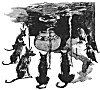

  
[Intangible Textual Heritage](../../../index.md)  [Native
American](../../index)  [Southwest](../index)  [Index](index.md) 
[Previous](pifs09)  [Next](pifs11.md) 

------------------------------------------------------------------------

p. 49

# VII

### THE COYOTE AND THE WOODPECKER

WELL, once upon a time a Coyote and his family lived near the edge of a
wood. There was a big hollow tree there, and in it lived an old
Woodpecker and his wife and children. One day as the Coyote-father was
strolling along the edge of the forest he met the Woodpecker-father.

"*Hin-no-kah-kée-ma*" (Good evening), said the Coyote; how do you do
to-day, friend Hloo-rée-deh?"

"Very well, thank you; and how are you, friend Too-wháy-deh?"

So they stopped and talked together awhile; and when they were about to
go apart the Coyote said:

"Friend Woodpecker, why do you not come as friends to see us? Come to
our house to supper this evening, and bring your family."

"Thank you, friend Coyote," said the Woodpecker; "we will come with
joy."

So that evening, when the Coyote-mother had made supper ready, there
came the Woodpecker-father and the Woodpecker-mother with their three
children. When they had come in, all five

p. 50

of the Woodpeckers stretched themselves as they do after flying, and by
that showed their pretty feathers--for the Hloo-rée-deh has yellow and
red marks under its wings. While, they were eating supper, too, they
sometimes spread their

[  
Click to enlarge](img/05000.jpg.md)  
THE COYOTES AT SUPPER WITH THE WOODPECKERS.  

wings, and displayed their bright under-side. They praised the supper
highly, and said the Coyote-mother was a perfect housekeeper. When it
was time to go, they thanked the Coyotes very kindly and invited them to
come to

p. 51

supper at their house the following evening. But when they were gone,
the Coyote-father could hold himself no longer, and he said:

"Did you see what airs those Woodpeckers put on? Always showing off
their bright feathers? But I want them to know that the Coyotes are
equal to them. *I'll* show them!"

Next day, the Coyote-father had all his family at work bringing wood,
and built a great fire in front of his house. When it was time to go to
the house of the Woodpeckers he called his wife and children to the
fire, and lashed a burning stick under each of their arms, with the
burning end pointing forward; and then he fixed himself in the same way.

"Now," said he, "we will show them! When we get there, you must lift up
your arms now and then, to show them that we are as good as the
Woodpeckers."

When they came to the house of the Woodpeckers and went in, all the
Coyotes kept lifting their arms often, to show the bright coals
underneath. But as they sat down to supper, one Coyote-girl gave a
shriek and said:

"Oh, *tata*! My fire is burning me!

"Be patient, my daughter," said the Coyote-father, severely, "and do not
cry about little things."

"Ow!" cried the other Coyote-girl in a moment, "my fire has gone out!"

This was more than the Coyote-father could stand, and he reproved her
angrily.

"But how is it, friend Coyote," said the Wood

p. 52

pecker, politely, "that your colors are so bright at first, but very
soon become black?"

"Oh, that is the beauty of our colors," replied the Coyote, smothering
his rage; "that they are not always the same--like other people's--but
turn all shades."

But the Coyotes were very uncomfortable, and made an excuse to hurry
home as soon as they could. When they got there, the Coyote-father
whipped them all for exposing him to be laughed at. But the
Woodpecker-father gathered his children around him, and said:

"Now, my children, you see what the Coyotes have done. Never in your
life try to appear what you are not. Be just what you really are, and
put on no false colors."

"Is that so?" cried the boys.

"That is so; and it is as true for people as for birds. Now,
*tóo-kwai*--for it is bedtime."

------------------------------------------------------------------------

[Next: VIII. The Man Who Married the Moon](pifs11.md)
