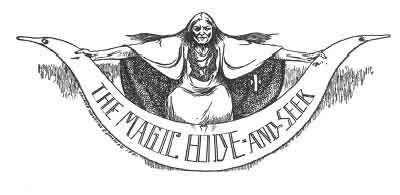
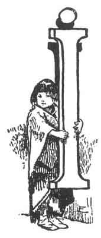
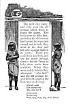

  
[Intangible Textual Heritage](../../../index.md)  [Native
American](../../index)  [Southwest](../index)  [Index](index.md) 
[Previous](pifs15)  [Next](pifs17.md) 

------------------------------------------------------------------------

p. 87

 

# XIII

### The Magic Hide and Seek

|                    |
|--------------------|
|  |

FANCY I must have been dozing after that hard ride; for when a far-away,
cracked voice that could be none other than Grandfather Ysidro's said,
"*Kah-whee-cá-me, Lorenso-kaí-deh*!" I started up so hastily as to bump
my head against the whitewashed wall. That may seem a queer sentence to
rouse one so sharply; and especially when you know what it means. It
meant that old Ysidro [1](#fn_49.md) had just
finished a story, which I had altogether missed, and was now calling
upon the old man next him to tell one, by using the customary Pueblo
saying:

"There is a tail to you, Father Lorenso!"

p. 88

Kah-whee-cá-me is what a Tée-wahn Indian always says in such a case,
instead of "Now you tell a story, friend." It is not intended as an
impolite remark, but merely refers to the firm belief of these quaint
people that if one were to act like a stubborn donkey, and refuse to
tell a story when called on, a donkey's tail would grow upon him!

With such a fate in prospect, you may be sure that the roundabout
invitation thus conveyed is never declined.

Grandfather Lorenso bows his head gravely, but seems in no haste. He is
indeed impressively deliberate as he slowly makes a cigarette from a bit
of corn-husk and a pinch of tobacco, lights it upon a coal raked out of
the fireplace by his withered fingers, blows a slow puff eastward, then
one to the north, another to the west, a fourth to the south, one
straight above his head, and one down toward the floor. There is one
part of the United States where the compass has *six* cardinal points
(those I have just named), and that is among these Indians, and in fact
all the others of the Southwest. The cigarette plays a really important
part in many sacred ceremonies of the Pueblos; for, as I have explained,
its collective smoke is thought to be what makes the rain-clouds and
brings the rain; and it is also a charm against witches.

Having thus propitiated the divinities who dwell in the directions
named, Lorenso looks about the circle to see if all are listening. The
glance satisfies him--as well it may. There are no heedless eyes or ears
in the audience, of which I am the

p. 89

only white member--and a very lucky one, in that I, an "Americano," am
allowed to hear these jealously guarded stories, and to see the silent
smoke-prayer which would never be made if a stranger were present. There
are seven aged men here, and nine bright-eyed boys--all *Isleteños*
(inhabitants of Isleta). We are huddled around the fireplace in the
corner of the big, pleasant room, against whose dark rafters and farther
white walls the shadows dance and waver.

And now, taking a deep puff, Lorenso exclaims:

"*Nah-t' hóo-ai*!" (In a house.) It has nothing to do with the story;
but is the prologue to inform the hearers that the story is about to
open.

"Ah-h-h!" we all responded, which is as much as to say, "We are
listening--go on"; and Lorenso begins his story.

 

Once upon a time there was a Tée-wahn village on the other side of the
mountain, and there lived a man and his wife who thought more of the
future of their children than did the others. To care better for the
children they moved to a little ranch some distance from the village,
and there taught their two little sons all they could. Both boys loved
the outdoors, and games, and hunting; and the parents were well pleased,
saying to each other:

"Perhaps some day they will be great hunters!"

By the time the elder boy was twelve and the younger ten, they both were
very expert with the little bows and arrows their father carefully made
them; and already they began to bring home many

p. 90

rabbits when they were allowed to go a little way from home. There was
only one command their parents gave about their hunts; and that was that
they must never, never go south. They could hunt to the east, north, and
west, but not south.

Day after day they went hunting, and more and more rabbits they killed,
growing always more expert.

One day when they had hunted eastward, the elder boy said:

"Brother, can you say any reason why we must not go south?"

"I know nothing," replied the younger, "except what I overheard our
parents saying one day. They spoke of an old woman who lives in the
south who eats children; and for that they said they would never let us
go south."

"Pooh!" said the elder, "I think nothing of *that*. The real reason must
be that they wish to save the rabbits in the south, and are afraid we
would kill them all. There must be many rabbits in that *bosque*
\[forest\] away down there. Let 's go and see--*they* won't know!"

The younger boy being persuaded, they started off together, and after a
long walk came to the *bosque*. It was full of rabbits, and they were
having great sport, when suddenly they heard a motherly voice calling
through the woods. In a moment they saw an old woman coming from the
south, who said to the boys:

"*Mah-kóo-oon* \[grandchildren\], what are you doing here, where no one
ever thinks to come?"

"We are hunting, Grandmother," they replied. "Our parents would never
let us come south; but

p. 91

to-day we came to see if the rabbits are more numerous here than above."

"Oh!" said the old woman, "this game you see here is *nothing*. Come,
and I will show you where there is much, and you can carry very large
rabbits home to your parents." But she was deceiving them.

She had a big basket upon her back, and stooping for the boys to get
into it, she carried them farther and farther into the woods. At last
they came to an old, battered house; and setting the basket down, she
said:

"Now we have come all the way here, where no one ever came before, and
there is no way out. You can find no trail, and you will have to stay
here contented, or I will eat you up!"

The boys were much afraid, and said they would stay and be contented.
But the old woman went into the house and told her husband--who was as
wicked as she--to get wood and build a big fire in the *horno*. [1](#fn_50.md) All day long the fire burned, and the oven
became hotter than it had ever been. In the evening the old witch-woman
raked out the coals, and calling the boys seized them and forced them
into the fiery oven.

 

"*Tahb-kóon-nahm*?" (Is that so?) we all exclaimed--that being the
proper response whenever the narrator pauses a moment.

"That is so," replied Lorenso, and went on.

 

Then the old woman put a flat rock over the little door of the oven, and
another over the smoke-hole,

p. 92

and sealed them both tight with clay. All that night she and her husband
were chuckling to think what a nice breakfast they would have--for both
of them were witch-people, and ate all the children they could find.

But in the morning when she unsealed the oven, there were the two boys,
laughing and playing together unhurt--for the Wháy-nin [1](#fn_51.md) had come to their aid and protected them
from the heat.

Leaving the boys to crawl out, the old woman ran to the house and
scolded the old man terribly for not having made the oven hot enough.
"Go this minute," she said, "and put in the oven all the wood that it
will hold, and keep it burning all day!"

When night came, the old woman cleaned the oven, which was twice as hot
as before; and again she put in the boys and sealed it up. But the next
morning the boys were unhurt and went to playing.

The witch-woman was very angry then; and giving the boys their bows and
arrows, told them to go and play. She staved at home and abused the old
witch-man all day for a poor fire-maker.

When the boys returned in the evening, she said:

"To-morrow, grandchildren, we will play *Nah-oo-p'ah-chée*
(hide-and-seek), and the one who is found three times by the other shall
pay his life."

The boys agreed, [2](#fn_52.md) and secretly prayed
to the Trues to help them--for by this time they knew that the old man
and the old woman "had the bad road."

p. 93

[  
Click to enlarge](img/09300.jpg.md)

The next day came; and very soon the old woman called them to begin the
game. The boys were to hide first; and when the old woman had turned her
eyes and vowed not to look, they went to the door and hid, one against
each of its jambs. There you could look and look, and see the wood
through them--for the Trues, to help them, made them invisible. When
they were safely hidden they whooped, "*Hee-táh*!" and the old woman
began to hunt, singing the hide-and-seek song:

*Hee-táh yahn  
Hee choo-ah-kóo  
Mee, mee, mee*?

(Now, now,  
Which way,  
Went they, went they, went they?)

 

p. 94

After hunting some time she called:

"You little fellows are on the door-posts. Come out!"

So the boys came out and "made blind" (covered their eyes) while the old
woman went to hide. There was a pond close by, with many ducks on it;
and making herself very little, she went and hid under the left wing of
the duck with a blue head. [1](#fn_53.md)

When they heard her "*Hee-táh*!" the boys went searching and singing;
and at last the elder cried out:

"Old woman, you are under the left wing of the whitest duck on the
lake--the one with the blue head. Come out!"

This time the boys made themselves small and crawled into the quivers
beside their bows and arrows. The old woman had to sing her song over a
great many times, as she went hunting all around; but at last she
called:

"Come out of the quivers where you are!"

Then the witch made herself very small indeed, and went behind the foot
of a big crane that was standing on one leg near the lake. But at last
the boys found her even there.

It was their last turn now, and the old woman felt very triumphant as
she waited for them to hide. But this time they went up and hid
themselves under the right arm of the Sun. [2](#fn_54.md) The old witch hunted everywhere, and used
all her bad power, but in vain; and when she was tired out she had

p. 95

 

[  
Click to enlarge](img/09500.jpg.md)  
''THE WITCH MADE HERSELF VERY SMALL, AND WENT BEHIND THE FOOT OF A BIG
CRANE.''  

 

p. 97

to cry, "*Hee-táh-ow*!" And then the boys came down from under the Sun's
arm rejoicing.

The old witch, taking her last turn, went to the lake and entered into a
fish, thinking that there she would be perfectly safe from discovery. It
did take the boys a great while to find her; but at last they shouted:

"Old woman, you are in the biggest fish in the lake. Come out!"

As she came walking toward them in her natural shape again, they called:
"Remember the agreement!" and with their sharp arrows they killed the
old witch-woman and then the old witch-man. Then they took away the two
wicked old hearts, and put in place of each a kernel of spotless corn;
so that if the witches should ever come to life again they would no
longer be witches, but people with pure, good hearts. They never did
come to life, however, which was just as well.

Taking their bows and arrows, the boys--now young men, for the four
"days" they had been with the witches were really four years--returned
home. At the village they found their anxious parents, who had come to
ask the Cacique to order all the people out to search.

When all saw the boys and heard their story, there was great rejoicing,
for those two witch-people had been terrors to the village for years. On
their account no one had dared go hunting to the south. And to this day
the game is thicker there than anywhere else in the country, because it
has not been hunted there for so long as in other places. The two young
men were forgiven for disobedience

p. 98

(which is a very serious thing at any age, among the Pueblos), and were
made heroes. The Cacique gave them his two daughters for wives, and all
the people did them honor. [1](#fn_55.md)

 

"Is that so?" we responded; and Lorenso replied, "That is so," gathering
his blanket and rising to go without "putting a tail" to any one, for it
was already late.

I may add that the game of hide-and-seek is still played by my dusky
little neighbors, the Pueblo children, and the searching-song is still
sung by them, exactly as the boys and the old witch played and sang--but
of course without their magical talent at hiding.

------------------------------------------------------------------------

### Footnotes

[87:1](pifs16.htm#fr_49.md) Pronounced Ee-seé-droh.

[91:1](pifs16.htm#fr_50.md) An outdoor bake-oven,
made of clay, and shaped like a beehive.

[92:1](pifs16.htm#fr_51.md) "The Trues," as the
Pueblos call their highest divinities.

[92:2](pifs16.htm#fr_52.md) For such a challenge,
which was once a common one with the Indians, could not possibly be
declined.

[94:1](pifs16.htm#fr_53.md) I should tell you that,
being a witch, she could not possibly have gone under the right wing.
Everything that is to the left belongs to the witches.

[94:2](pifs16.htm#fr_54.md) Who is, in the Pueblo
belief, the father of all things.

[98:1](pifs16.htm#fr_55.md) This story seems to be
one of the myths about the Hero Twin Brothers, the children of the Sun.
They are, next to Sun-Father and Moon-Mother, the chief deities of all
the southwestern tribes. In the Quères folk-lore they figure very
prominently; but in the Tée-wahn are more disguised.

------------------------------------------------------------------------

[Next: XIV. The Race of the Tails](pifs17.md)
