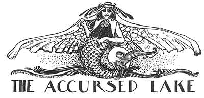
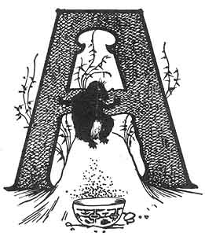
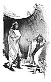
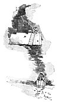

  
[Intangible Textual Heritage](../../../index.md)  [Native
American](../../index)  [Southwest](../index)  [Index](index.md) 
[Previous](pifs19)  [Next](pifs21.md) 

------------------------------------------------------------------------

p. 108

 

# XVII

### THE ACCURSED LAKE

|                    |
|--------------------|
|  |

WAY to the southeast of the Manzano Mountains, two days' journey from my
pueblo of Isleta, are the shallow salt lakes. For scores of miles their
dazzling sheen is visible--a strange patch of silver on the vast brown
plains. They are near the noblest ruins in our North America--the
wondrous piles of massive masonry of Abó, Cuaray, and the so-called
"Gran Quivira"--the latter the home of the silliest delusion that ever
lured treasure-hunters to their death. The whole region has a romantic
history, and is important to the scientific student. From that locality

p. 109

came, centuries ago, part of the people who then founded Isleta, and
whose descendants dwell here to this day. Perhaps you would like to know
why those lakes are salt now--for my Indian neighbors say that once they
were fresh and full of fish, and that the deer and buffalo came from all
the country round to drink there. The story is very important
ethnologically, for it tells much of the strange secret religion of the
Pueblos, and more concerning the, method of initiating a young Indian
into one of the orders of medicine-men--both matters which men of
science have found extremely difficult to be learned. Here is the story
as it is believed by the Tée-wahn, and as it was related to me by one of
them.

 

Long ago there was still a village east of Shoo-paht-hóo-eh, the
Eagle-Feather (Manzano) Mountains, and in it lived a famous hunter. One
day, going out on the plains to the east, he stalked a herd of
antelopes, and wounded one with his arrows. It fled eastward, while the
herd went south; and the hunter began to trail it by the drops of blood.
Presently he came to the largest lake, into which the trail led. As he
stood on the bank, wondering what to do, a fish thrust its head from the
water and said:

"Friend Hunter, you are on dangerous ground!" and off it went swimming.
Before the Hunter could recover from his surprise, a Lake-Man came up
out of the water and said:

"How is it that you are here, where no human ever came?"

p. 110

The Hunter told his story, and the Lake-Man invited him to come in. When
he had entered the lake, he came to a house with doors to the east,
north, west, and south, and a trap-door in the roof, with a ladder; and
by the latter door they entered. In their talk together the Lake-Man
learned that the Hunter had a wife and little son at home.

"If that is so," said he, "why do you not come and live with me? I am
here alone, and have plenty of other food, but I am no hunter. We could
live very well here together." And opening doors on four sides of the
room he showed the Hunter four other huge rooms, all piled from floor to
ceiling with corn and wheat and dried squash and the like.

"That is a very good offer," said the astonished Hunter. "I will come
again in four days; and if my Cacique will let me, I will bring my
family and stay."

So the Hunter went home--killing an antelope on the way--and told his
wife all. She thought very well of the offer; and he went to ask
permission of the Cacique. The Cacique demurred, for this was the best
hunter in all the pueblo, [1](#fn_62.md) but at
last consented and gave him his blessing.

So on the fourth day the Hunter and his wife and little boy came to the
lake with all their property. The Lake-Man met them cordially, and gave
the house and all its contents into the charge of the woman. [2](#fn_63.md)

Some time passed very pleasantly, the Hunter going out daily and
bringing back great quantities

p. 111

 

[  
Click to enlarge](img/11100.jpg.md)  
THE HUNTER AND THE LAKE-MAN.  

 

p. 113

of game. At last the Lake-Man, who was of an evil heart, pretended to
show the Hunter something in the east room; and pushing him in, locked
the great door and left him there to starve--for the room was full of
the bones of men whom he had already entrapped in the same way.

The boy was now big enough to use his bow and arrows so well that he
brought home many rabbits; and the witch-hearted Lake-Man began to plot
to get him, too, out of the way.

So one morning when the boy was about to start for a hunt, he heard his
mother groaning as if about to die; and the Lake-Man said to him:

"My boy, your mother has a terrible pain, and the only thing that will
cure her is some ice from T'hoor-p'ah-whée-ai \[Lake of the Sun\], [1](#fn_64.md) the water from which the sun rises."

"Then," said the boy, straightway, if that is so, I will take the heart
of a man \[that is, be brave\] and go and get the ice for my little
mother." And away he started toward the unknown east.

Far out over the endless brown plains he trudged bravely; until at last
he came to the house of Shee-chóo-hlee-oh, the Old-Woman-Mole, who was
there all alone--for her husband had gone to hunt. They were dreadfully
poor, and the house was almost falling down, and the poor, wrinkled
Old-Woman-Mole sat huddled in the corner by the fireplace, trying to
keep warm by a few dying coals. But when the boy knocked, she rose and
welcomed him kindly and gave him all there was in the house to eat--a
wee bowl of soup with a

p. 114

patched-up snowbird in it. The boy was very hungry, and picking up the
snowbird bit a big piece out of it.

"Oh, my child!" cried the old woman, beginning to weep. "You have ruined
me! For my husband trapped that bird these many years ago, but we could
never get another; and that is all we have had to eat ever since. So we
never bit it, but cooked it over and over and drank the broth. And now
not even that is left." And she wept bitterly.

"Nay, Grandmother, do not worry," said the boy. "Have you any long
hairs?"--for he saw many snowbirds lighting near by.

"No, my child," said the old woman sadly.

"There is no other living animal here, and you are the first human that
ever came here."

But the boy pulled out some of his own long hair and made snares, and
soon caught many birds. Then the Old-Woman-Mole was full of joy; and
having learned his errand, she said:

"My son, fear not, for I will be the one that shall help you. When you
come into the house of the Trues, they will tempt you with a seat; but
you must sit down only on what you have. [1](#fn_65.md) Then they will try you with smoking the
*weer*, but I will help you."

Then she gave him her blessing, and the boy started away to the east. At
last, after a weary, weary way, he came so near the Sun Lake, that the
*Whit-lah-wíd-deh* [2](#fn_66.md) of the Trues saw
him coming, and went in to report.

p. 115

"Let him be brought in," said the Trues; and the Whit-lah-wíd-deh took
the boy in and in through eight rooms, until he stood in the presence of
all the gods, in a vast room. There were all the gods of the East, whose
color is white, and the blue gods of the North, the yellow gods of the
West, the red gods of the South, and the rainbow-colored gods of the Up,
the Down, and the Center, all in human shape. Beyond their seats were
all the sacred animals--the buffalo, the bear, the eagle, the badger,
the mountain lion, the rattlesnake, and all the others that are powerful
in medicine.

Then the Trues bade the boy sit down, and offered him a white *manta*
(robe) for a seat; but he declined respectfully, saying that he had been
taught, when in the presence of his elders, to sit on nothing save what
he brought, and he sat upon his blanket and moccasins. When he had told
his story, the Trues tried him, and gave him the sacred *weer* to
smoke--a hollow reed rammed with *pee-en-hleh*. [1](#fn_67.md) He smoked, and held the smoke bravely. But
just then the Old-Woman-Mole, who had followed him underground all this
way, dug a hole up to his very toes; and the smoke went down through his
feet into the hole, and away back to the Old-Woman-Mole's house, where
it poured out in a great cloud. And not the tiniest particle escaped
into the room of the Trues. He finished the second *weer* [2](#fn_68.md) without being sick at all; and
the\[paragraph continues\]

p. 116

Trues said, "Yes, he is our son. But we will try him once more." So they
put him into the room of the East with the bear and the lion; and the
savage animals came forward and breathed on him, but would not hurt him.
Then they put him into the room of the North, with the eagle and the
hawk; then into the room of the West, with the snakes; and lastly, into
the room of the South, where were the Apaches and all the other human
enemies of his people. And from each room he came forth unscratched.

"Surely," said the Trues, "this is our son! But once more we will try
him."

They had a great pile of logs built up ("cob-house" fashion), and the
space between filled with pine-knots. Then the Whit-lah-wíd-deh set the
boy on the top of the pile and lighted it.

But in the morning, when the guard went out, there was the boy unharmed
and saying: "Tell the Trues I am cold, and would like more fire."

Then he was brought again before the Trues, who said: "Son, you have
proved yourself a True Believer, and now you shall have what you seek."

So the sacred ice was given him, and he started homeward--stopping on
the way only to thank the Old-Woman-Mole, to whose aid he owed his
success.

When the wicked Lake-Man saw the boy coming, he was very angry, for he
had never expected him to return from that dangerous mission. But he
deceived the boy and the woman; and in a few days made a similar excuse
to send the boy to the gods of the South after more ice for his mother.

p. 117

The boy started off as bravely as before. When he had traveled a great
way to the south, he came to a drying lake; and there, dying in the mud,
was a little fish.

"*Ah-bóo* \[poor thing\], little fish," said the boy; and picking it up,
he put it in his gourd canteen of water. After awhile he came to a good
lake; and as he sat down to eat his lunch the fish in his gourd said:

"Friend Boy, let me swim while you eat, for I love the water."

So he put the fish in the lake; and when he was ready to go on, the fish
came to him, and he put it back in his gourd. At three lakes he let the
fish swim while he ate; and each time the fish came back to him. But
beyond the third lake began a great forest which stretched clear across
the world, and was so dense with thorns and brush that no man could pass
it. But as the boy was wondering what he should do, the tiny fish
changed itself into a great Fish-Animal with a very hard, strong
skin, [1](#fn_69.md) and bidding the boy mount upon
its back, it went plowing through the forest, breaking down big trees
like stubble, and bringing him through to the other side without a
scratch.

"Now, Friend Boy," said the Fish-Animal, "you saved my life, and I will
be the one that shall help you. When you come to the house

p. 118

of the Trues, they will try you as they did in the East. And when you
have proved yourself, the Cacique will bring you his three daughters,
from whom to choose you a wife. The two eldest are very beautiful, and
the youngest is not; but you ought to choose her, for beauty does not
always reach to the heart."

The boy thanked his fish-friend and went on, until at last he came to
the house of the Trues of the South. There they tried him with the
*weer* and the fire, just as the Trues of the East had done, but he
proved himself a man, and they gave him the ice. Then the Cacique
brought his three daughters, and said:

"Son, you are now old enough to have a wife, [1](#fn_70.md) and I see that you are a true man who will
dare all for his mother. Choose, therefore, one of my daughters."

The boy looked at the three girls; and truly the eldest were very
lovely. But he remembered the words of his fish friend, and said:

"Let the youngest be my wife."

Then the Cacique was pleased, for he loved this daughter more than both
the others. And the boy and the Cacique's daughter were married and
started homeward, carrying the ice and many presents.

When they came to the great forest, there was the Fish-Animal waiting
for them, and taking both on his back he carried them safely through. At
the first lake he bade them good-by and blessed them, and they trudged
on alone.

p. 119

 

[  
Click to enlarge](img/11900.jpg.md)  
THE CURSING OF THE LAKE.  

 

p. 121

At last they came in sight of the big lake, and over it were great
clouds, with the forked lightning leaping forth. While they were yet far
off, they could see the wicked Lake-Man sitting at the top of his
ladder, watching to see if the boy would return, and even while they
looked they saw the lightning of the Trues strike him and tear him to
shreds.

When they came to the lake the boy found his mother weeping for him as
dead. And taking his wife and his mother,--but none of the things of the
Lake-Man, for those were bewitched,--the boy came out upon the shore.
There he stood and prayed to the Trues that the lake might be accurst
forever; and they heard his prayer, for from that day its waters turned
salt, and no living thing has drunk therefrom.

------------------------------------------------------------------------

### Footnotes

[110:1](pifs20.htm#fr_62.md) All hunters give the
Cacique a tenth of their game, for his support.

[110:2](pifs20.htm#fr_63.md) As is the custom among
all Pueblo Indians.

[113:1](pifs20.htm#fr_64.md) Located "somewhere to
the east"; perhaps the ocean.

[114:1](pifs20.htm#fr_65.md) That is, upon his
blanket and moccasins, the unvarying etiquette of the Medicine House.

[114:2](pifs20.htm#fr_66.md) One of an order of
medicine-men, who among other duties, act as guards of the Medicine
House.

[115:1](pifs20.htm#fr_67.md) The smoking of the
pungent *weer* is a very severe ordeal; and it is a disgrace to let any
of the smoke escape from the mouth or nose.

[115:2](pifs20.htm#fr_68.md) Two being the usual
number given a candidate for initiation into a medicine order.

[117:1](pifs20.htm#fr_69.md) It is quite possible
that this "Fish-Animal with a hard, strong skin," living far to the
south, is the alligator. Of course, the Pueblos never saw that strange
saurian; but they probably heard of it in the earliest days from nomad
tribes, and as a great scientist has pointed out, we may always depend
upon it that there is a nucleus of truth in all these folk-myths. Such a
strange animal, once heard of, would be very sure to figure in some
story.

[118:1](pifs20.htm#fr_70.md) For it must be
remembered that all these travels had taken many years.

------------------------------------------------------------------------

[Next: XVIII. The Moqui Boy and the Eagle](pifs21.md)
