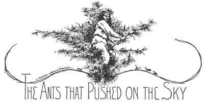
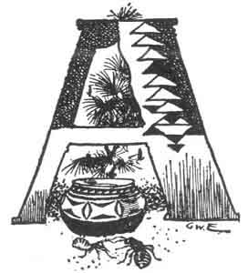
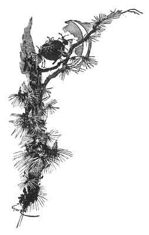
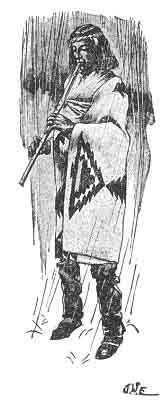

  
[Intangible Textual Heritage](../../../index)  [Native
American](../../index)  [Southwest](../index)  [Index](index) 
[Previous](pifs24)  [Next](pifs26) 

------------------------------------------------------------------------

p. 147

 

# XXII

### THE ANTS THAT PUSHED ON THE SKY

|                    |
|--------------------|
|  |

VERY ancient and characteristic story about the origin of Isleta is
based on the historic fact that part of its founders came from east of
the Manzano Mountains, from one of the prehistoric pueblos whose ruins
are now barely visible in those broad plains.

Once upon a time there lived in one of those villages (so runs the
story) a young Indian named Kahp-too-óo-yoo, the Corn-stalk Young Man.
He was not only a famous hunter and a brave warrior against the raiding
Comanches, but a great wizard; and to him the Trues had given the power
of the clouds. When Kahp-too-óo-yoo willed it, the glad rains fell, and
made the dry fields laugh in green;

p. 148

and without him no one could bring water from the sky. His father was
Old-Black-Cane, his mother was Corn-Woman, and his two sisters were
Yellow-Corn-Maiden, and Blue-Corn-Maiden.

Kahp-too-óo-yoo had a friend, a young man of about the same age. But, as
is often true, the friend was of a false heart, and was really a witch,
though Kahp-too-óo-yoo never dreamed of such a thing.

The two young men used to go together to the mountains to get wood, and
always carried their bows and arrows, to kill deer and antelopes, or
whatever game they might find.

One day the false friend came to Kahp-too-óo-yoo, and said:

"Friend, let us go to-morrow for wood, and to hunt."

They agreed that so they would do. Next day they started before sunrise,
and came presently to the spot where they gathered wood. just there they
started a herd of deer. Kahp-too-óo-yoo followed part of the herd, which
fled to the northwest, and the friend pursued those that went southwest.
After a long, hard chase, Kahp-too-óo-yoo killed a deer with his swift
arrows, and brought it on his strong back to the place where they had
separated. Presently came the friend, very hot and tired, and with empty
hands; and seeing the deer, he was pinched with jealousy.

"Come, friend," said Kahp-too-óo-yoo. "It is well for brothers to share
with brothers. Take of this deer and cook and eat; and carry a part to
your house, as if you had killed it yourself

p. 149

"Thank you," answered the other coldly, as one who will not; but he did
not accept.

When they had gathered each a load of wood, and lashed it with rawhide
thongs in bundles upon their shoulders, they trudged
home--Kahp-too-óo-yoo carrying the deer on top of his wood. His sisters
received him with joy, praising him as a hunter; and the friend went
away to his house, with a heavy face.

Several different days when they went to the mountain together, the very
same thing came to pass. Kahp-too-óo-yoo killed each time a deer; and
each time the friend came home with nothing, refusing all offers to
share as brothers. And he grew more jealous and more sullen every day.

At last he came again to invite Kahp-too-óo-yoo to go; but this time it
was with an evil purpose that he asked. Then again the same things
happened. Again the unsuccessful friend refused to take a share of
Kahp-too-óo-yoo's deer; and when he had sat long without a word, he
said:

"Friend Kahp-too-óo-yoo, now I will prove you if you are truly my
friend, for I do not think it."

"Surely," said Kahp-too-óo-yoo, "if there is any way to prove myself, I
will do it gladly, for truly I am your friend."

"Then come, and we will play a game together, and with that I will prove
you."

"It is well! But what game shall we play, for here we have nothing?"

Near them stood a broken pine-tree, with one great arm from its twisted
body. And looking at it, the false friend said:

p. 150

"I see nothing but to play the *gallo* race; and because we have no
horses [1](#fn_80) we will ride this arm of the
pine-tree--first I will ride, and then you."

So he climbed the pine-tree, and sat astride the limb as upon a horse,
and rode, reaching over to the ground as if to pick up the
chicken. [2](#fn_81)

"Now you," he said, coming down; and Kahp-too-óo-yoo climbed the tree
and rode on the swinging branch. But the false friend bewitched the
pine, and suddenly it grew in a moment to the very sky, carrying
Kahp-too-óo-yoo.

"We do this to one another," taunted the false friend, as the tree shot
up; and taking the wood, and the deer which Kahp-too-óo-yoo had killed,
he went to the village. There the sisters met him, and asked:

"Where is our brother?"

"Truly I know not, for he went northwest and I southwest; and though I
waited long at the meeting-place, he did not come. Probably he will soon
return. But take of this deer which I killed, for sisters should share
the labors of brothers."

But the girls would take no meat, and went home sorrowful.

Time went on, and still there was no Kahp-too-óo-yoo. His sisters and
his old parents wept always, and all the village was sad. And soon the
crops grew yellow in the fields, and the springs failed, and the animals
walked like weary shadows; for Kahp-too-óo-yoo, he who had the power of
the

p. 151

clouds, was gone, and there was no rain. And then perished all that is
green; the animals fell in the brown fields; and the gaunt people who
sat to warm themselves in the sun began to die there where they sat. At
last the poor old man said to his daughters:

"Little daughters, prepare food, for again we will go to look for your
brother."

The girls made cakes of the blue corn-meal for the journey; and on the
fourth day they started. Old-Black-Cane hobbled to the south, his wife
to the east, the elder girl to the north, and the younger to the west.

For a great distance they traveled; and at last Blue-Corn-Maiden, who
was in the north, heard a far, faint song. It was so little that she
thought it must be imaginary; but she stopped to listen, and softly,
softly it came again:

*Tó-ai-fóo-ni-hlóo-hlim,  
Eng-k'hai k'háhm;  
Eé-eh-bóori-kóon-hlee-oh,  
Ing-k'hai k'háhm.  
Ah-ee-ái, ah-hee-ái,  
Aim!*

(Old-Black-Cane  
My father is called;  
Com-Woman  
My mother is called.  
*Ah-ee-ái, ah-hee-ái,  
Aim*!)

When she heard this, Blue- Corn- Maiden ran until she came to her
sister, and cried:

p. 152

"Sister! Sister! I think I hear our brother some. where in captivity.
Listen!"

Trembling, they listened; and again the song came floating to them, so
soft, so sad that they wept- as to this day their people weep when a
white-haired old man, filled with the memories of Kahp-too-óo-yoo, sings
that plaintive melody.

"Surely it is our brother!" they cried; and off they went running to
find their parents. And when all listened together, again they heard the
song.

"Oh, my son!" cried the poor old woman, "in what captivity do you find
yourself? True it is that your father is Old-Black-Cane, and I, your
mother, am called Corn-Woman. But why do you sing thus?"

Then all four of them began to follow the song, and at last they came to
the foot of the sky-reaching pine; but they could see nothing of
Kahp-too-óo-yoo, nor could their cries reach him. There, on the ground,
were his bow and arrows, with strings and feathers eaten away by time;
and there was his pack of wood, tied with the rawhide thong, ready to be
taken home. But after they had searched everywhere, they could not find
Kahp-too-óo-yoo; and finally they went home heavy at heart.

At last it happened that P'ah-whá-yoo-óo-deh, the Little Black Ant, took
a journey and went up the bewitched pine, even to its top in the sky.
When he found Kahp-too-óo-yoo there a prisoner, the Little Black Ant was
astonished, and said:

"Great *Kah-báy-deh* \[Man of Power\], how comes

p. 153

 

[  
Click to enlarge](img/15300.jpg)  
SOUTH, LAST, NORM, AND WEST IN SEARCH OF KAHP-TOO-ÓO-YOO.  

 

p. 155

it that you are up here in such a condition, while your people at home
are suffering and dying for rain, and few are left to meet you if you
return? Are you here of your free will?"

"No," groaned Kahp-too-óo-yoo; "I am here because of the jealousy of him
who was as my brother, with whom I shared my food and labor, whose home
was my home, and my home his. He is the cause, for he was jealous and
bewitched me hither. And now I am dying of famine."

"If that is so," said the Little Black Ant, "I will be the one to help
you"; and he ran down to the world as fast as he could. When he got
there he sent out the crier to summon all his nation, and also that of
the *In-toon*, the Big Red Ants. Soon all the armies of the Little Black
Ants and the Big Red Ants met at the foot of the pine, and held a
council. They smoked the *weer* and deliberated what should be done.

"You Big Red Ants are stronger than we who are small," said the
War-Captain of the Little Black Ants, "and for that you ought to take
the top of the tree to work."

"*Een-dah*!" (No) said the War-Captain of the Big Red Ants. "If you
think we are the stronger, give us the bottom, where we can work more,
and you go to the top."

So it was agreed, and the captains made their armies ready. But first
the Little Black Ants got the cup of an acorn, and mixed in it corn-meal
and water and honey, and carried it up the tree. They were so many that
they covered its trunk all the way to the sky.

p. 156

|                    |
|--------------------|
|  |

When Kahp-too-óo-yoo saw, his heart was heavy, and he thought: "But what
good will that very little do me, for I am dying of hunger and thirst?"
"Nay, friend," answered the Captain of the Little Black Ants, who knew
his thought. "A person should not think so. This little is enough, and
there will be some left."

And it was so; for when Kahp-too-óo-yoo had eaten all he could, the
acorn-cup was still nearly full. Then the ants carried the cup to the
ground and came back to him. "Now, friend," said the Captain, "we will
do our best. But now you must shut your eyes till I say '*Ahw!*'"

Kahp-too-óo-yoo shut his eyes, and the Captain sent signals down to
those at the foot of the tree. And the Little Black Ants above put their
feet against the sky and pushed with all their might on the top of the
pine; and the Big Red Ants below caught the trunk and pulled as hard as
they could; and the very first tug drove the great pine a quarter of its
length into the earth.

p. 157

"*Ahw*!" shouted the Captain of the Little Black Ants, and
Kahp-too-óo-yoo opened his eyes; but he could see nothing below.

"Shut your eyes again," said the Captain, giving the signal. Again the
Little Black Ants pushed mightily against the sky, and the Big Red Ants
pulled mightily from below; and the pine was driven another fourth of
its length into the earth.

"*Ahw*!" cried the Captain; and when Kahp-too-óo-yoo opened his eyes he
could just see the big, brown world.

Again he closed his eyes. There was another great push and pull, and
only a quarter of the pine was left above the ground. Now
Kahp-too-óo-yoo could see, far below, the parched fields strewn with
dead animals, and his own village full of dying people.

Again the Little Black Ants pushed and the Big Red Ants pulled, and this
time the tree was driven clear out of sight, and Kahp-too-óo-yoo was
left sitting on the ground. He hastily made a bow and arrows and soon
killed a fat deer, which he brought and divided among the Little Black
Ants and the Big Red Ants, thanking them for their kindness.

Then he made all his clothing to be new, for he had been four years a
prisoner in the bewitched tree, and was all in rags. Making for himself
a flute from the bark of a young tree, he played upon it as he strode
homeward and sang:

*Kahp-too-óo-yoo tú-mah-quee,  
Nah-chóor kwé-shay-tin,  
Nah-shúr kwé-shay-tin;  
Kahp-too-óo-yoo tú-mah-quee!*

p. 158

(Kahp-too-óo-yoo has come to life again,  
Is back to his home coming,  
Blowing the yellow and the blue;  
Kahp-too-óo-yoo has come to life again!)

As he walked and sang, the forgotten clouds came over him, and the soft
rain began to fall, and all 

<table data-align="LEFT">
<colgroup>
<col style="width: 100%" />
</colgroup>
<tbody>
<tr class="odd">
<td data-valign="CENTER"> 
KAHP-TOO-ÓO-YOO CALLING THE RAIN.</td>
</tr>
</tbody>
</table>

was green and good. But only so far as his voice reached came the rain;
and beyond all was still death and drought. When he came to the end of
the wet, he played and sang again; and again the rain fell as far as his
voice was heard. This time the Fool-Boy, who was wandering outside the
dying village, saw the far storm and heard the singing. He ran to tell
Kahp-too-óo-yoo's parents; but nobody would believe a Foolish, and they
sent him away.

When the Fool-Boy went out again, the rain fell on him and gave him
strength, and he came running a second time to tell. Then the sisters
came out of the house and saw the rain and heard the song; and they
cried for joy, and told their parents to rise and meet him. But the poor
old people were dying of weakness, and could not rise; and the sisters
went

p. 159

alone. When they met him they fell on their knees, weeping; but
Kahp-too-óo-yoo lifted them up and blessed them, gave an ear of blue
corn to Blue-Corn-Maiden, and to Yellow-Corn-Maiden an ear of yellow
corn, and brought them home.

As he sang again, the rain fell in the village; and when it touched the
pinched faces of the dead they sat up and opened their mouths to catch
it. And the dying crawled out to drink, and were strong again; and the
withered fields grew green and glad.

When they came to the house, Kahp-too-óo-yoo blessed his parents, and
then said:

"Little sisters, give us to eat."

But they answered, "How? For you have been gone these four years, and
there was none to give us rain. We planted, but nothing came, and today
we ate the last grain."

"Nay, little sisters" he said. "A person should not think so. Look now
in the store-rooms, if there be not something there."

"But we have looked and looked, and turned over everything to try to
find one grain."

"Yet look once more," he said; and when they opened the door, lo! there
was the store-room piled to the roof with corn, and another room was
full of wheat. Then they cried for joy, and began to roast the blue
ears, for they were dying of hunger.

At the sweet smell of the roasting corn came the starving neighbors,
crowding at the door, and crying:

"O Kahp-too-óo-yoo! Give us to taste one grain of corn, and then we will
go home and die."

p. 160

But Kahp-too-óo-yoo handed to each an ear, and said:

"Fathers, brothers, go now to your own houses, for there you will find
corn as much as here." And when they went, it was so. All began to roast
corn and to eat; and the dead in the houses awoke and were strong again,
and all the village sang and danced.

From that time there was plenty of rain, for he who had the power of the
clouds was at home again. In the spring the people planted, and in the
fall the crops were so great that all the town could not hold them; so
that which was left they brought to Shee-eh-whíb-bak (Isleta), where we
enjoy it to this day.

As for the false friend, he died of shame in his house, not daring to
come out; and no one wept for him.

------------------------------------------------------------------------

### Footnotes

[150:1](pifs25.htm#fr_81) This mention of the
horse is, of course, modern. I think it is an interpolation. The rest of
the story bears traces of great antiquity.

[150:2](pifs25.htm#fr_82) In imitation of one of
the most popular and exciting sports of the Southwestern Indians and
Mexicans.

------------------------------------------------------------------------

[Next: XIII. The Man Who Wouldn't Keep Sunday](pifs26)
