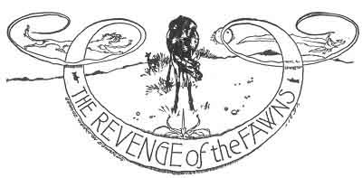
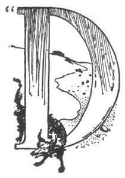
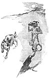

  
[Intangible Textual Heritage](../../../index)  [Native
American](../../index)  [Southwest](../index)  [Index](index) 
[Previous](pifs27)  [Next](pifs29) 

------------------------------------------------------------------------

p. 178

 

# XXV

### THE REVENGE OF THE FAWNS

|                    |
|--------------------|
|  |

ON CARLOS," said Vitorino, throwing another log upon the fire, which
caught his tall shadow and twisted it and set it dancing against the
rocky walls of the cañon in which we were camped for the night, "did you
ever hear why the Wolf and the Deer are enemies?" And as he spoke he
stretched out near me, looking up into my face to see if I were going to
be interested.

A few years ago it would have frightened me very seriously to find
myself thus--alone in one of the remotest corners of New Mexico save for
that swarthy face peering up into mine by the weird light of the
camp-fire. A stern, quiet but manly face it seems to me now; but once I
would have

p. 179

thought it a very savage one, with its frame of long, jet hair, its
piercing eyes, and the broad streak of red paint across its cheeks. By
this time, however, having lived long among the kindly Pueblos, I had
shaken off that strange, ignorant prejudice against all that is
unknown--which seems to be inborn in all of us--and wondered that I
could ever have believed in that brutal maxim, worthy only of worse than
savages, that "A good Indian is a dead Indian." For Indians are men,
after all, and astonishingly like the rest of us when one really comes
to know them.

I pricked up my ears--very glad at his hint of another of these
folk-stories.

"No," I answered. "I have noticed that the Wolf and the Deer are not on
good terms, but never knew the reason."

"*Si, señor*," said he,--for Vitorino knows no English, and most of our
talk was in Spanish, which is easier to me than the Tée-wahn
language,--"that was very long ago, and now all is changed. But once the
Wolf and the Deer were like brothers; and it is only because the Wolf
did very wickedly that they are enemies. *Con su licencia,
señor*." [1](#fn_91)

"*Bueno; anda*!" [2](#fn_92)

So Vitorino leaned his shoulders against a convenient rock and began.

 

Once upon a time, when the Wolf and the Deer were friends, there were
two neighbors in the country beyond the Rio Puerco, not far from where
the

p. 180

pueblo of Laguna (a Quères town) now is. One was a Deer-mother who had
two fawns, and the other a Wolf-mother with two cubs. They had very good
houses of adobe, just such as we live in now, and lived like real people
in every way. The two were great friends, and neither thought of going
to the mountain for firewood or to dig *amole* [1](#fn_93) without calling for the other to accompany
her.

One day the Wolf came to the house of the Deer and said:

"Friend Peé-hlee-oh \[Deer-woman\], let us go to-day for wood and
*amole*, for I must wash to-morrow."

"It is well, friend Káhr-hlee-oh," replied the Deer. "I have nothing to
do, and there is food in the house for the children while I am gone.
*Toó-kwai*! \[Let us go\]."

So they went together across the plain and into the hills till they came
to their customary spot. They gathered wood and tied it in bundles to
bring home on their backs, and dug *amole*, which they put in their
shawls to carry. Then the Wolf sat down under a cedar-tree and said:

"*Ai*! But I am tired! Sit down, friend Deer-woman, and lay your head in
my lap, that we may rest."

"No, I am not tired," replied the Deer.

"But just to rest a little," urged the Wolf The Deer good-naturedly lay
down with her head in the lap of her friend. But soon the Wolf bent down
and caught the trusting Deer by the throat, and

p. 181

killed her. That was the first time in the world that any one betrayed a
friend, and from that deed comes all the treachery that is.

The false Wolf took off the hide of the Deer, and cut off some of the
meat and carried it home on her load of *amole* and wood. She stopped at
the house of the Deer, and gave the Fawns some of the accursed meat,
saying:

"Friends, Deer-babies, do not fear, but eat; your mother met relatives
and went to their house, and she will not come to-night."

The Fawns were very hungry, and as soon as the Wolf had gone home they
built a big fire in the fireplace and set the meat to cook. But at once
it began to sputter and to hiss, and the Fawn who was tending it heard
it cry, "Look out! look out! for this is your mother!"

He was greatly frightened, and called his brother to listen, and again
the same words came from the meat.

"The wicked old Wolf has killed our *nana*! \[mama\]," they cried, and,
pulling the meat from the fire, they laid it gently away and sobbed
themselves to sleep.

Next morning the Wolf went away to the mountain to bring the rest of the
deer-meat; and when she was gone her Cubs came over to play with the
Fawns, as they were used to doing. When they had played awhile, the Cubs
said:

"*Pee-oo-wée-deh* \[little Deer\],why are you so prettily spotted, and
why do you have your eyelids red, while we are so ugly?"

"Oh," said the Fawns, "that is because when

p. 182

we were little, like you, our mother put us in a room and smoked us, and
made us spotted."

"Oh, Fawn-friends, can't you spot us, too, so that we may be pretty?"

So the Fawns, anxious to avenge the death of their mother, built a big
fire of corn-cobs in the fireplace, and threw coyote-grass on it to make
a great smoke. Then, shutting the Cubs into the room, they plastered up
the door and windows with mud, and laid a flat rock on top of the
chimney and sealed it around with mud; and climbing down from the roof,
they took each other's hands and ran away to the south as fast as ever
they could.

After they had gone a long way, they came to a Coyote. He was walking
back and forth with one paw to his face, howling dreadfully with the
toothache. The Fawns said to him very politely:

"*Ah-bóo*! \[poor thing\]. Old-man friend, we are sorry your tooth
hurts. But an old Wolf is chasing us, and we cannot stay. If she comes
this way, asking about us, do not tell her, will you?"

"*Een-dah*. Little-Deer-friends, I will not tell her"--and he began to
howl again with pain, while the Fawns ran on.

When the Wolf came to her home with the rest of the meat, the Cubs were
not there; and she went over to the house of the Deer. It was all sealed
and still; and when she pushed in the door, there were her Cubs dead in
the smoke! When she saw that, the old Wolf was wild with rage, and vowed
to follow the Fawns and eat them without mercy. She soon found their
tracks leading away

p. 183

 

[  
Click to enlarge](img/18300.jpg)  
THE WOLF, AND THE COYOTE WITH THE TOOTHACHE.  

 

p. 185

to the south, and began to run very swiftly in pursuit.

In a little while she came to the Coyote, who was still walking up and
down, howling so that one could hear him a mile away. But not pitying
his pain, she snarled at him roughly:

"Say, old man! have you seen two Fawns running away?"

The Coyote paid no attention to her, but kept walking with his hand to
his mouth, groaning, "*Mm-m-páh! Mm-m-páh!*"

Again she asked him the same question, more snappishly, but he only
howled and groaned. Then she was very angry, and showed her big teeth as
she said:

"I don't care about your '*Mm-m-páh! Mm-m-páh!*' Tell me if you saw
those Fawns, or I'll eat you this very now!"

"Fawns? *Fawns*?" groaned the Coyote--"I have been wandering with the
toothache ever since the world began. And do you think I have had
nothing to do but to watch for Fawns? Go along, and don't bother me."

So the Wolf, who was growing angrier all the time, went hunting around
till she found the trail, and set to running on it as fast as she could
go.

By this time the Fawns had come to where two Indian boys were playing
*k'wah-t'hím* [1](#fn_94) with their bows and
arrows, and said to them:

"Friends boys, if an old Wolf comes along and asks if you have seen us,
don't tell her, will you?"

The boys promised that they would not, and the \[paragraph continues\]

p. 186

Fawns hurried on. But the Wolf could run much faster, and soon she came
to the boys, to whom she cried gruffly:

"You boys! did you see two Fawns running this way?"

But the boys paid no attention to her, and went on playing their game
and disputing: "My arrow's nearest!" "No; mine is!" "'T ain't! Mine is!"
She repeated her question again and again, but got no answer till she
cried in a rage:

"You little rascals! Answer me about those Fawns, or I'll eat you!"

At that the boys turned around and said:

"We have been here all day, playing *k'wah-t'hím*, and not hunting
Fawns. Go on, and do not disturb us."

So the Wolf lost much time with her questions and with finding the trail
again; but then she began to run harder than ever.

In the mean time the Fawns had come to the bank of the Rio Grande, and
there was *P'ah-chah-hlóo-hli*, the Beaver, hard at work cutting down a
tree with his big teeth. And they said to him very politely:

"Friend Old-Crosser-of-the-Water, will you please pass us over the
river?"

The Beaver took them on his back and carried them safely across to the
other bank. When they bad thanked him, they asked him not to tell the
old Wolf about them. He promised he would not, and swam back to his
work. The Fawns ran and ran, across the plain, till they came to a big
black hill of lava that stands alone in the valley southeast of Tomé.

p. 187

 

[  
Click to enlarge](img/18700.jpg)  
THE WOLF MEETS THE BOYS PLAYING WITH THE BOWS AND ARROWS.  

 

p. 189

"Here!" said one of the Fawns, "I am sure this must be the place our
mother told us about, where the Trues of our people live. Let us look."

And when they came to the top of the hill, they found a trap-door in the
solid rock. When they knocked, the door was opened and a voice called,
"Enter!" They went down the ladder into a great room underground; and
there they found all the Trues of the Deer-people, who welcomed them and
gave them food.

When they had told their story, the Trues said:

"Fear not, friends, for we will take care of you."

And the War-captain picked out fifty strong young bucks for a guard.

By this time the Wolf had come to the river, and there she found the
Beaver hard at work and grunting as he cut the tree.

"Old man!" she snarled, "did you see two Fawns here?"

But the Beaver did not notice her, and kept on walking around the tree,
cutting it and grunting "*Ah-oó-mah! Ah-oó-mah!*"

She was in a terrible rage now, and roared:

"I am not talking '*Ah-oó-mah*!' to you. I'm asking if you saw two
Fawns."

"Well," said the Beaver, "I have been cutting trees here by the river
ever since I was born, and I have no time to think about Fawns."

The Wolf, crazy with rage, ran up and down the bank, and at last came
back and said:

"Old man, if you will carry me over the river I will pay you; but if you
don't, I'll eat you up."

"Well, wait then till I cut around the tree three

p. 190

times more," said the Beaver; and he made her wait. Then he jumped down
in the water and took her on his neck, and began to swim across. But as
soon as he came where the water was deep, he dived to the bottom and
stayed there as long as he could.

"Ah-h-h!" sputtered the Wolf when he came to the surface. As soon as the
Beaver got a breath, down he went again; and so he kept doing all the
way across, until the Wolf was nearly drowned--but she clung to his neck
desperately, and he could not shake her off.

When they came to the shore the old Wolf was choking, coughing, and
crying, and so mad that she would not pay the Beaver as she had
promised--and from that day to this the Beaver will never again ferry a
Wolf across the river.

Presently she found the trail, and came running to the hill. When she
knocked on the trap-door a voice from within called, "Who?"

"Wolf-woman," she answered as politely as she could, restraining her
anger.

"Come down," said the voice, and hearing her name the fifty young
Deer-warriors--who had carefully whetted their horns--stood ready. The
door flew open, and she started down the ladder. But as soon as she set
her foot on the first rung, all the Deer-people shouted:

"Look what feet!" For, though the Deer is so much larger than the Wolf,
it has smaller feet.

At this she was very much ashamed, and pulled back her foot; but soon
her anger was stronger, and she started down again. But each time the
\[paragraph continues\]

p. 191

 

[  
Click to enlarge](img/19100.jpg)  
''THE FAWNS APPEARED SUDDENLY, AND AT SIGHT OF THEM THE WOLF DROPPED THE
SPOONFUL OF SOUP.''  

 

p. 193

Deer-people laughed and shouted, and she drew back.

At last they were quiet, and she came down the ladder. When she had told
her story the old men of the Deer-people said:

"This is a serious case, and we must not judge it lightly. Come, we will
make an agreement. Let soup be brought, and we will eat together. And if
you eat all your soup without spilling a drop, you shall have the
Fawns."

"Ho!" thought the Wolf. "*That* is easy enough, for I will be very
careful." And aloud she said: "It is well. Let us eat."

So a big bowl of soup was brought, and each took a *guayave* [1](#fn_95) and rolled it like a spoon to dip up the
soup. The old Wolf was very careful, and had almost finished her soup
without spilling a drop. But just as she was lifting the last sup to her
mouth the Fawns appeared suddenly in the door of the next room, and at
sight of them she dropped the soup in her lap.

"She spilled!" shouted all the Deer-people, and the fifty chosen
warriors rushed upon her and tore her to pieces with their sharp horns.

That was the end of the treacherous Wolf; and from that day the Wolf and
the Deer have been enemies, and the Wolf is a little afraid of the Deer.
And the two Fawns? Oh, they still live with the Deer-people in that
black hill below Tomé.

------------------------------------------------------------------------

### Footnotes

[179:1](pifs28.htm#fr_92) "With your permission,
sir."

[179:2](pifs28.htm#fr_93) "All right; go ahead!"

[180:1](pifs28.htm#fr_94) The root of the
palmilla, generally used for soap throughout the Southwest.

[185:1](pifs28.htm#fr_95) A sort of walking
archery.

[193:1](pifs28.htm#fr_96) An Indian bread made
by spreading successive films of blue corn-meal batter on a flat hot
stone. It looks more like a piece of wasp's nest than anything else, but
is very good to eat.

------------------------------------------------------------------------

[Next: XXVI. The Sobbing Pine](pifs29)
