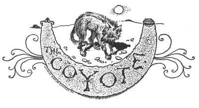
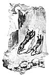
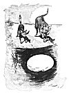

  
[Intangible Textual Heritage](../../../index.md)  [Native
American](../../index)  [Southwest](../index)  [Index](index.md) 
[Previous](pifs33)  [Next](pifs35.md) 

------------------------------------------------------------------------

p. 222

 

# XXXI

### THE COYOTE

ALL the animals with which the Tée-wahn are familiar--the buffalo (which
they used to hunt on the vast plains to the eastward), the bear, deer,
antelope, mountain lion, badger, wild turkey, fox, eagle, crow, buzzard,
rabbit, and so on--appear in their legends and fairy tales, as well as
in their religious ceremonials and beliefs. Too-wháy-deh, the
Coyote, [1](#fn_103.md) or little prairie wolf,
figures in countless stories, and always to his own disadvantage. Smart
as he is in some things, he believes whatever is told him; and by his
credulity becomes the butt of all the other animals, who never tire of
"April-fooling" him. He is also a great coward. To call an Indian here
"*Too-wháy-deh*" is one of the bitterest insults that can be offered
him.

p. 223

You have already heard how the Coyote fared at the hands of the
fun-loving Bear, and of the Crows and the Blackbirds. A very popular
tale is that of his adventure with a bright cousin of his.

Once upon a time Too-wháy-shur-wée-deh, the Little-Blue-Fox, [1](#fn_104.md) was wandering near a pueblo, and chanced
to come to the threshing-floors, where a great many crows were hopping.
just then the Coyote passed, very hungry; and while yet far off, said:
"Ai! how the stomach cries! I will just eat Little-Blue-Fox." And
coming, he said:

"Now, Little-Blue-Fox, you have troubled me enough! You are the cause of
my being chased by the dogs and people, and now I will pay you. I am
going to eat you up this very now!"

"No, Coyote-friend," answered the Little-Blue-Fox, "*don't* eat me up! I
am here guarding these chickens, for there is a wedding in yonder house,
which is my master's, and these chickens are for the wedding-dinner.
Soon they will come for the chickens, and will invite me to the
dinner-and you can come also."

"Well," said the Coyote, "if *that* is so, I will not eat you, but will
help you watch the chickens." So he lay down beside him.

At this, Little-Blue-Fox was troubled, thinking how to get away; and at
last he said:

"Friend Too-wháy-deh, I make strange that they have not before now come
for the chickens. Perhaps they have forgotten. The best way is for

p. 224

me to go to the house and see what the servants are doing."

"It is well," said the Coyote. "Go, then, and I will guard the chickens
for you."

So the Little-Blue-Fox started toward the house; but getting behind a
small hill, he ran away with fast feet. When it was a good while, and he
did not come back, the Coyote thought: "While he is gone, I will give
myself some of the chickens." Crawling up on his belly to the
threshing-floor, he gave a great leap. But the chickens were only crows,
and they flew away. Then he began to say evil of the Little-Blue-Fox for
giving him a trick, and started on the trail, vowing: "I will eat him up
wherever I catch him."

After many miles he overtook the Little-Blue-Fox, and with a bad face
said: "Here! Now I am going to eat you up!"

The other made as if greatly excited, and answered: "No, friend Coyote!
Do you not hear that *tombé* [1](#fn_105.md)?"

The Coyote listened, and heard a drum in the pueblo.

"Well," said the Little-Blue-Fox, "I am called for that dance, [2](#fn_106.md) and very soon they will come for me.
Won't you go too?"

"If that is so, I will not eat you, but we will go to the dance." And
the Coyote sat down and began to comb his hair and to make himself
pretty with face-paint. When no one came, the Little-Blue-Fox said:

p. 225

 

[  
Click to enlarge](img/22500.jpg.md)  
''THERE THEY STOOP SIDE BY SIDE.''  

 

p. 227

"Friend Coyote, I make strange that the *alguazil* does not come. It is
best for me to go up on this hill, whence I can see into the village.
You wait here."

"He will not dare to give me another trick," thought the Coyote. So he
replied: "It is well. But do not forget to call me."

So the Little-Blue-Fox went up the hill; and as soon as he was out of
sight, he began to run for his life.

Very long the Coyote waited; and at last, being tired, went up on the
hill--but there was no one there. Then he was very angry, and said: "I
will follow him, and eat him surely! *Nothing* shall save him!" And
finding the trail, he began to follow as fast as a bird.

just as the Little-Blue-Fox came to some high cliffs, he looked back and
saw the Coyote coming over a hill. So he stood up on his hind feet and
put his fore paws up against the cliff, and made many groans, and was as
if much excited. In a moment came the Coyote, very angry, crying: "Now
you shall not escape me! I am going to eat you up now--now!"

"Oh, no, friend Too-wháy-deh!" said the other; "for I saw this cliff
falling down, and ran to hold it up. If I let go, it will fall and kill
us both. But come, help me to hold it."

Then the Coyote stood up and pushed against the cliff with his fore
paws, very hard; and there they stood side by side.

Time passing so, the Little-Blue-Fox said:

"Friend Too-wháy-deh, it is long that I am

p. 228

holding up the cliff, and I am very tired and thirsty. You are fresher.
So you hold up the cliff while I go and hunt water for us both; for soon
you too will be thirsty. There is a lake somewhere on the other side of
this mountain; I will find it and get a drink, and then come back and
hold up the cliff while you go."

The Coyote agreed, and the Little-Blue-Fox ran away over the mountain
till he came to the lake, just as the moon was rising.

But soon the Coyote was very tired and thirsty, for he held up the cliff
with all his might. At last he said: "Ai! how hard it is! I am so
thirsty that I will go to the lake, even if I die!"

So he began to let go of the cliff, slowly, slowly--until he held it
only with his finger-nails; and then he made a great jump away backward,
and ran as hard as he could to a hill. But when he looked around and saw
that the cliff did not fall, he was very angry, and swore to eat
Too-wháy-shur-wée-deh the very minute he should catch him.

Running on the trail, he came to the lake; and there the Little-Blue-Fox
was lying on the bank, whining as if greatly excited. "Now I *will* eat
you up, this minute!" cried the Coyote. But the other said: "No, Friend
Too-wháy-deh! Don't eat me up! I am waiting for some one who can swim as
well as you can. I just bought a big cheese [1](#fn_107.md) from a shepherd to share with you; but
when I went to drink, it slipped out of my hands into the water.
\[paragraph continues\]

p. 229

 

[  
Click to enlarge](img/22900.jpg.md)  
'''HOW SHALL I GET IT?' SAID THE COYOTE.''  

 

p. 231

Come here, and I will show you." He took the Coyote to the edge of the
high bank, and pointed to the moon in the water.

"M----m!" said the Coyote, who was fainting with hunger. "But how shall
I get it? It is very deep in the water, and I shall float up before I
can dive to it."

"That is true, friend," said the other." There is but one way. We must
tie some stones to your neck, to make you heavy so you can go down to
it."

So. they hunted about until they found a buckskin thong and some large
stones; and the Little-Blue-Fox tied the stones to the Coyote's neck,
the Coyote holding his chin up, to help.

"Now, friend Too-wháy-deh, come here to the edge of the bank and stand
ready. I will take you by the back and count weem, *wée-si, p'áh-chu!*,
And when I say *three*, you must jump and I will push-for now you are
very heavy."

So he took the Coyote by the back of the neck, swaying him back and
forth as he counted. And at "*p'áh-chu!*" he pushed hard, and the Coyote
jumped, and went into the deep water, and--never came out again!

------------------------------------------------------------------------

### Footnotes

[222:1](pifs34.htm#fr_104.md) Pronounced
Coy-óh-ty.

[223:1](pifs34.htm#fr_105.md) He is always a hero,
and as smart as the Coyote is stupid. His beautiful pelt is an important
part of the costume worn in many of the sacred dances of the Tée-wahn.

[224:1](pifs34.htm#fr_106.md) Pronounced tom-báy.
The sacred drum used in Pueblo dances.

[224:2](pifs34.htm#fr_107.md) In all such Indian
dances the participants are named by the officials.

[228:1](pifs34.htm#fr_108.md) Of course chickens
and cheeses were not known to the Pueblos before the Spanish conquest;
and the cheese is so vital a part of the story that I hardly think it
can be an interpolation. So this tale, though very old, is probably not
ancient--that is, it has been invented since 1600.

------------------------------------------------------------------------

[Next: XXXII. Doctor Field-Mouse](pifs35.md)
