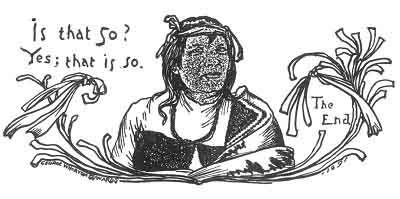

  
[Intangible Textual Heritage](../../../index.md)  [Native
American](../../index)  [Southwest](../index)  [Index](index.md) 
[Previous](pifs36.md) 

------------------------------------------------------------------------

p. 252

### GRANDMA-SPIDER

Now here is the story "made English." First I did a Spanish version, and
went over it several times with the Indian narrator, who could
understand Spanish and agreed that it was a good translation of the
original. Then I tried it on other Indians; and they all voted it
"Kú-chu." I have not tried to keep the metrical form, but tell the story
so that Americans will understand it in exactly the same sense that the
Indian boys and girls understood it when it was told them in the soft
and musical Tée-wahn.

 

Once upon a time, they say, Old-Man-with-a-Black-Cane and his wife
Ear-of-Corn-Woman lived with their children-with their daughter
Yellow-Corn-Girl, and her baby, and their little son Na-chur-ú-chu
(whose name means Boy-of-the-Blue-of-Dawn).

Old-Man-with-a-Black-Cane was the Rain-Maker of the pueblo, and worked
to bring the rains. His wife was without eyes (blind). The little boy
Na-chur-ú-chu used to play *whib* [1](#fn_117.md)
in the morning. Then his sister Yellow-Corn-Girl used

p. 253

to grind corn on the *metate*. The old mother used to take care of the
baby and to work, weaving a belt. She used to tie the baby at the end of
the belt, so that he could play while she worked.

One day she thought about the belt and pulled it back, and there was no
boy tied to it. An eagle had watched the child. That one day the eagle
came and stole the child; and when his grandmother pulled the belt there
was no child tied to it. Then she cried to her daughter,
Yellow-Corn-Girl: "Hurry, come out! I don't know where our little child
is." Then they began to ask about him from everybody all around. Nobody
had seen him. Then notice (official heralding) was given throughout the
pueblo to hunt for him; but nowhere could he be found, though they kept
looking for him a long time. And all the people were sorry.

Then Old-Man-with-a-Black-Cane no longer worked to bring the rain. And
there was no rain. And all the corn got dry. Then all the people were
hungry. Then at last again Na-chur-ú-chu went out to play *whib* in the
morning; and somewhere on a high mesa, in the middle of the day, as he
passed by in his playing, he heard on this inaccessible cliff a child
singing:

"*I am the grandson of Old-Black-Cane*." [1](#fn_118.md)

When Na-chur-ú-chu heard this, he stopped and listened long. And again
he heard the same song. And he said to himself: "Isn't this my nephew?
Certainly it is."

p. 254

Then he went running back to the pueblo; and when got there he said: "My
nephew has been stolen away by the eagle! That's why I heard him crying,
up where nobody can reach him."

Then they told him in the pueblo: "Go again tomorrow, and see if you
hear the same." Then he went again next day. And it was true, for he
heard the same thing again. And he said to himself: "It certainly is so,
for that is my nephew."

And when he told it in the pueblo, the young men were ordered to go and
bring the child down from the mesa; but they could not scale it.

The Stone-Layers (a kind of swallow) [1](#fn_119.md) were flying all around; and the young
men said to them: "Say, Birds, what do you want us to pay you to go up
there and bring down the child that is lying there?" But the birds did
n't pay any attention, and kept on flying and singing their song, crying
up and down, as they sailed up and down:

"*Chee! chee! chee! chee!*"

Then the young men asked them again to help rescue the child; and at
last one bird paid attention and said: "There *is* someone talking." And
all the birds listened.

Again the young men said to them: "What payment do you want to bring our
child down to us?"

And the birds said: "Piñon nuts."

"All right," said the young men.

p. 255

The birds went up and tried to bring down the child; but they could not,
and then they came back and said they were unable. The young men paid
them their price in piñon nuts just the same.

Then the birds said: "We will go to Old Grandmother-Spider." And so they
went, and they came to where Old Grandmother-Spider lived. She said:
"What do you want?"

And they told her. And she said: "Is it so? The poor child makes a
noise. Wait, my grandsons, wait for me, let me eat first; and I want you
to eat with me."

So she made her dinner by putting out some acorn-cups with mush and
atole.

The birds said: "Mercy, poor us! Who will fill these shells up for us?"
But the Grandmother-Spider said: "Grandsons, you should not think that
way. Eat, and fill yourselves."

"Thank you, Grandmother," they said; and they ate, and they were filled.
Then she took a big basket of her own weaving, and they all went to the
mesa. The young men of the pueblo were waiting. They said to her:
"Grandmother, would you dare go away up to where the child is lying, and
bring him down to us?" And the Spider-Grandmother said: "Yes, but you
must take care not to look up at what I am doing." Then she went up.
"Here he is!" she cried; and she hung the basket.

And they could not help it, but looked up to see where the
Grandmother-Spider and the basket were; and when they looked up, the
basket blew away.

p. 256

Then she called to them: "Grandsons, you must not do that;" and she was
very sorry. So they said: "Grandmother, now we will not look up." So
again she hung the basket, and brought down the boy.

But he was not a boy any more, but a young eagle--just a young eagle. So
they carried this young eagle back to the pueblo, and tried what way
they could make him a child again instead of an eagle. The Wise Old Men
fasted for four days; and then after the four days' fast they worked in
the night to change him back.

They set down the eagle-child among them, and they sang the first words
of the sacred songs, and they rolled the sacred ma-koor hoop.

And when they sang the first words of the song and rolled the ma-koor
hoop, the eagle-child became "like people" down to his neck. But the
rest of him was like a young eagle.

Again they sang the song and rolled the hoop, and he became "like
people" down to the waist. The third time they sang the song and rolled
the hoop, and he was "like people" down to the knees; and with the
fourth singing and rolling he was "like people" down to the ankles; and
with the fifth he was a perfect boy again. And so it was finished.

Then the Wise Men warmed water, and made him drink it until he vomited;
and he vomited up all the snakes, the coyotes, rabbits, mice, and other
things which the eagle had fed him.

Then when he was restored to his natural shape, and purified, they
carried him to the arms of his

p. 257

parents. Then once more Old-Man-with-a-Black-Cane began to work for
rain; and the rain came down, and it came upon the fields; and the corn
came up and blossomed, and then it ripened. So about that time the
people came to the Cacique and told him they were ready to pick corn;
and it was proclaimed that the corn should be picked; and the people
went out and picked the corn and brought it out to the Cacique's house;
and they filled his house up full, and more was left. They carried corn
throughout the pueblo to the east, to the north, to the northwest, to
the west, to the south, and all the other quarters of the Compass, as he
told them (giving enough to everybody).

 

And so they were all very glad in the pueblo, and lived happy, and had
enough to eat.

You have a tail on you. (Now it's *your* turn to tell a story.)

 

------------------------------------------------------------------------

### Footnotes

[252:1](pifs37.htm#fr_118.md) An ancient game in
which the players race many miles, kicking a small stick ahead of them.
They must touch it only with their toes. The aboriginal name of Isleta
is Shee-eh-whíb-bak--meaning
"Knife-shaped-Ridge-where-they-play-*whib*." The pueblo is built on a
knife-shaped reef of lava running across the ancient channel of the Rio
Grande.

[253:1](pifs37.htm#fr_119.md) The rest of the
verse is in an unknown language, and probably archaic.

[254:1](pifs37.htm#fr_120.md) Stone-Layers--that
is, masons; because these swallows build their nests of mud and pebbles
on cliffs, under roofs, or in any sheltered place, in a fashion which
makes one clan of the Pueblos believe they descended from the swallows
and taught all the other Pueblos to be "Stone-Layers" and build adobe
houses.
