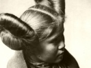

  
[Intangible Textual Heritage](../../../index)  [Native
American](../../index)  [Southwest](../index)  [Index](index) 
[Previous](sot44)  [Next](sot46) 

------------------------------------------------------------------------

  
*Songs of the Tewa*, by Herbert Joseph Spinden, \[1933\], at Intangible
Textual Heritage

------------------------------------------------------------------------

##### XL

##### WHEN THE DEER COME

*So the deer will hear*  
    Our elder brother deer,  
    Our elder sister deer,  
    We are going to meet you,  
    We are going to meet you.

*They meet the deer*  
    Then deer will come,  
    Then deer will come,  
    Come on with us  
    Come on with us.  
    *Na-e-e-e, Ya-e-a-e-na  
*    *Na-e-e-e, ya-e-e-e-na*.

*When the deer dance*.  
    Now you follow us  
    Now you follow us  
    Here we are dancing  
    Here we are dancing  
    In this manner  
    In this manner  
    *Yo-ha-ri-yo, yo-ha-ri-yo  
*    *A-a-a-he-yo-o*.

------------------------------------------------------------------------

[Next: XLI. Eagle Song](sot46)

