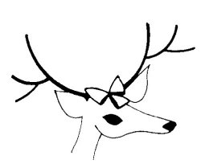

  
[Intangible Textual Heritage](../../../index)  [Native
American](../../index)  [Southwest](../index)  [Index](index) 
[Next](yml01) 

------------------------------------------------------------------------

 

# YAQUI MYTHS AND LEGENDS

## COLLECTED BY RUTH WARNER GIDDINGS

### Harry Behn, Editor

### Illustrated by Laurie Cook

#### The University of Arizona Press Tucson, Arizona

##### Originally issued as Anthropological Paper No. 2, University of Arizona, 1959

###### Scanned at Intangible Textual Heritage, September, 2004. John Bruno Hare redactor. This text is in the public domain because it was not registered or renewed at the US Copyright Office (source: LOCIS database), as required by law at the time. This eBook is for the use of anyone anywhere at no cost and with almost no restrictions whatsoever. You may copy it, give it away or re-use it subject to the sacred-texts terms of service (https://ith.oarc.science/tos.htm).

 

------------------------------------------------------------------------

[Next: Contents](yml01)
