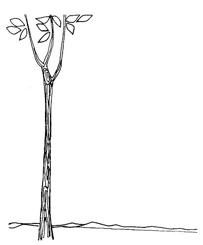

  
[Intangible Textual Heritage](../../../index)  [Native
American](../../index)  [Southwest](../index)  [Index](index) 
[Previous](yml05)  [Next](yml07) 

------------------------------------------------------------------------

p. 25

 

# The Stories

### Yomumuli and the Little Surem People

LONG BEFORE the Conquest of the Spaniards, when all of the land which is
now Mexico was wild, this country was called Suré. It was thus called
because it was populated by the Surem, children of Yomumuli. All
Indians, the Hueleves, the Opatas, the Pimas, the Papagos, the Seris,
were created by her. At that time there were animals living on land and
in the water. Huge turtles lived in the permanent water of the river and
the sea. This was before we had agriculture.

There was a huge thick stick which reached from the ground to the sky.
This stick kept talking, making a humming noise like bees. The

p. 26

\[paragraph continues\] Yaquis had very wise men in those days of the
Surem, as we do now, but none of the Indians, nor the wise men could
understand what the stick was saying. Only Yomumuli could understand and
she wanted to help her people whom she had created. She didn't
particularly care what the stick was saying, but she told what it said.
It was telling the Indians and the animals how to live. It told the
animals which were to live by hunting, and which to live by eating
grass. It told how, someday, the Conquest would come, how Jesucristo
would appear, as he was to appear to all people. She herself didn't like
the laws very much. Some of the laws were disagreeable to the Indians,
and they did not like Yomumuli's interpretations of the truth as sent by
Dios in the sky to the people on earth.

Many people said that Yomumuli was just making all this up. According to
her, the talking tree said that the people would soon have leaders,
captains, and would be baptized. The people did not believe this.

Yomumuli was angry that her people did not believe, though she herself
felt as they did. It didn't matter to her what this stick was saying.
She did not like it. But she knew that it was true.

Since she did not like what was going to come to pass Yomumuli decided
to go away. She was angry and decided to take her river with her. "I am
going north," she said. And she took this river, rolled it up, put it
under her arm, and walked away on the clouds toward the north.

The people did not like the prospect of this Conquest which was coming.
So they either descended into the earth to live inside of hills or

p. 27

they went to live in the sea. They were very powerful people, these
Surem. Yomumuli left a chief on each hill and the hills were named for
these men. These chiefs did not like the coming Conquest either.

Only a few people liked what the stick predicted and these waited. These
men are the Yaquis. They grew to be taller than the Surem who had gone
away. The Surem were little people, but very strong. They still live in
the hills and the sea. They favor man and help him when they can. Some,
in the sea, are like sirens and live on islands. Others are whales who
come near to a boat to warn it when it is in danger. All of the Surem
are wild pagans. If a Yaqui is lost in the monte, these little people
help him by bringing him food and fire, and then they go away. Some say
the Surem are very rich and have many cattle under the hills. LC

 

The Papago story of the Ashes People mentions a talking tree (Densmore
1929: 23). A myth of the Tepecanos of Mexico resembles the last part of
this Yaqui myth in telling of half of the people being opposed to the
coming of baptism and going away to the north (Mason 1914: 148-149).

------------------------------------------------------------------------

[Next: The Ku Bird](yml07)
