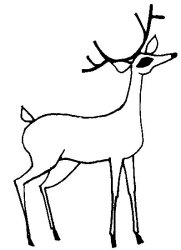

  
[Intangible Textual Heritage](../../../index.md)  [Native
American](../../index)  [Southwest](../index)  [Index](index.md) 
[Previous](yml07)  [Next](yml09.md) 

------------------------------------------------------------------------

p. 30

 

### The Wise Deer

THERE ONCE lived a large deer. He was very strong, and very wise. So
wise was he that when hunters searched for him, wherever he might hide
himself, they could never find him. They might pursue him closely, but
he, in his wisdom, would hide wherever he chose. The hunters would pass
by, close to him, but never see him.

Thus it went on. There were times when many gathered in a group to hunt
him. But he knew when they were surrounding him, and he did not go out
from his hiding place. So it was that they could never catch him.

After many years, the deer attained a great age. Then, he wanted the
hunters to kill him, for he was tired of living. He presented himself to
the hunters. But they would pay no attention to his presence, for they
said, "He is now very old."

Many times the poor, old animal followed the trails which hunters
frequented in hopes that he might encounter a trap in which he might put
his head or his feet, but he could not find them.

In weariness he spoke to the twilight, saying, "Now I render myself up."
And he died. The tale is finished here.

------------------------------------------------------------------------

[Next: Tasi'o Sewa](yml09.md)
