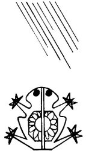

  
[Intangible Textual Heritage](../../../index)  [Native
American](../../index)  [Southwest](../index)  [Index](index) 
[Previous](yml09)  [Next](yml11) 

------------------------------------------------------------------------

p. 32

### Yuku

|                    |
|--------------------|
|  |

IN THE TIMES when there was no corn, the blackbird told man about this
corn that is sown. He knew where corn was and that the Devil had it. Man
sent the blackbird up there after it because he knew that this bird was
very good at stealing. The blackbird went to the house of Yuku and sat
down on a branch, and the Devil said,

"Now what is it that you are going to rob me of today?"

The blackbird did not say.

When the Devil forgot him, the blackbird stole corn and brought it to
man, saying, "This is to eat. Make a little hole in the ground and bury
it. Take care of the corn while it is growing up."

The corn sprouted but, when it was still little, it was dying of thirst
because there had been no rain. Man talked to the blackbird about it and
the blackbird said, "I'm going up there to bring rain and then you can
irrigate. When the corn has rain it will grow."

"That is well," said man. And the blackbird went to the God of the Rains
and said, "You know that man down there, don't you? Will you send him
rain?"

"Yes," said Yuku, the God of Rain. "I will go down there right away. You
go on ahead of me!" So the blackbird went on, and the god followed him
and caught up with him and beat him and threw him about with wind. Then
the god returned to his house. So the blackbird returned to man without
any rain. He said, "The god beat me with wind. Send someone else to see
if he can bring rain."

Then man ordered the road-runner to the house of the God of Rain. The
bird arrived at

p. 33

the house of the God of Rain and said, "You know that man down there,
don't you? He wants you to send him rain!"

"Ah, yes, good. I'll go there. Hurry up and go ahead of me!" The
road-runner had traveled a short distance when Yuku began to throw bolts
at him, chasing and beating him with wind. After this, the god returned
to his house without reaching the earth. The road-runner went to man and
said, "I could not bring rain because Yuku beat me with wind. Now send
someone else up there."

"All right," said man, and he spoke with the toad, saying, "Toad, I want
you to bring rain to us if you can."

"I can bring it," said the toad. He went up to the house of Yuku, sowing
his children behind him on the road all the way. Then he said, "Yuku,
you know that man down there, don't you? He wants rain."

"I know," said the God of Rain. "You go on ahead of me and I'll come
behind and catch up."

Toad began to return, and in a short time the god caught up with him.
Toad was singing along the road and before him on the road all of his
sons sang also. Yuku went from one toad to the next and the next and
finally arrived where the corn was sown. He irrigated it and it grew. It
formed cars, they ripened, and gave corn. Then men had corn.

This myth is included by permission of Jean B. Johnson (1940 MS). in
another version of this story, "The First Fire," the toads bring man
fire with the help of the crow, the road-runner and the dog. In a third
version, "Bobok," the toad brings rain; corn is not mentioned.

------------------------------------------------------------------------

[Next: When Badger Named the Sun](yml11)
