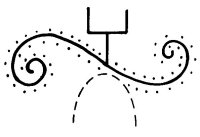

  
[Intangible Textual Heritage](../../../index.md)  [Native
American](../../index)  [Southwest](../index)  [Index](index.md) 
[Previous](yml12)  [Next](yml14.md) 

------------------------------------------------------------------------

p. 37

 

### The Wax Monkey

IN A CERTAIN part of the Yaqui region lived a farmer who had many
watermelons ripe in his field. He noticed that every morning some of his
best, his prettiest, and his largest watermelons were missing. Finally
he said, "I would like to know who it is that is eating my watermelons."

So he set to work to make a monkey out of wax. When he finished it, he
put it in the middle of his field. "Here you will stay," said the old
man to the wax monkey. "If some thief comes along, don't let him get
away." He planted the wax monkey there and went away to sleep in
tranquility.

During the night, Coyote went into the field to eat watermelon. When he
saw the wax monkey he said, "Get out of here and leave me alone so I can
eat watermelon." Since the monkey didn't answer, Coyote became very
angry and said, "If you don't go away I will beat you." The monkey
didn't move, so Coyote raised his hand and hit

 

p. 38

the monkey on his head, and his hand stuck there. This made Coyote even
more angry and he said, "If you don't let me go I will hit you in the
stomach with my other hand!" And he struck the monkey in the middle with
all his might. His hand went right through and stayed stuck in the
stomach of the wax monkey.

"Aha!" shouted Coyote, "then I'll kick you!" And he kicked him with one
foot, then the other. Both feet stuck. He then beat his head against the
wax monkey and his head stuck. Finally he struck him with his tail and
it also stuck.

Early in the morning when the farmer came to his field he found every
part of Coyote stuck to the wax monkey. He put the thief into a cage and
set a large clay olla full of water on the fire. When the water was
boiling, he threw it over Coyote and burned off his fur.

It is said that Coyote ran around naked until he died and the buzzards
ate him.

 

------------------------------------------------------------------------

[Next: The False Beggar](yml14.md)
