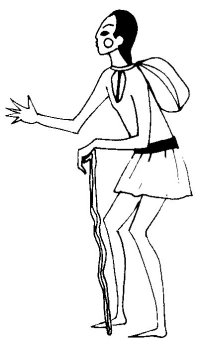

  
[Intangible Textual Heritage](../../../index)  [Native
American](../../index)  [Southwest](../index)  [Index](index) 
[Previous](yml13)  [Next](yml15) 

------------------------------------------------------------------------

p. 39

 

### The False Beggar

HE WAS FALSE because though he was not poor he asked for alms. Abahta
Chaheme was a tall, healthy man but he pretended to be old, dressed as a
beggar, and asked for charity.

This man had an only daughter, now grown, whose name was Wokkoi Masa.
Abahta Chaheme had many sheep and goats and also horses and cattle; yet
he continued asking for alms. He did nothing else. Some people would
give him corn. Others would give him two or three little kids or lambs.
Thus he had become rich indeed.

Finally one day a young Yaqui man came to his house. This man was a
skilled cowboy and a hunter and also a tanner of hides. He made

p. 40

skin clothing and sold it for money. His name was E'esuki. Well, this
man fell in love with the young daughter of the rich beggar and she also
loved him very much. The young man, E'esuki, talked with the beggar,
asking permission to marry his daughter.

Abahta Chaheme said, "Yes, it is well. But to support yourself you must
do as I do."

"What is it that you would like me to do?" asked E'esuki.

"Dress yourself as a poor man, use a cane, carry a skin bag about your
neck and another over your shoulders and go everywhere, to all of the
rancherías and ask alms. This you will do each day until you have
fulfilled six months. Then you may marry my daughter."

"Oh, no, sir," said the young man, "I have no need to ask charity for I
know how to work at many things. I can earn money in order to support
and dress her well and beautifully."

"Then you may not marry my daughter. I will not permit it unless you
enter into this bargain."

"But sir," said E'esuki, "I do not know how to ask for alms. I do not
want to because I am not hungry. I am an expert hunter. Every day I have
fresh meat."

"Well, if you love my daughter and if you want to marry her, beg."

"Thank you very much. Good-by," said the young man, E'esuki.

He went away and in three days returned to the beggar's house to ask
[Abahta](errata.htm#0) Chaheme again for his daughter. She was a
beautiful girl with very large and pretty eyes.

But the beggar did not want to give E'esuki permission to marry his
daughter. Then E'esuki

p. 41

said, "Well, father, I will beg for alms for six months because I want
very much to marry this pretty little girl."

"Very well," said Abahta Chaheme. And he disguised the boy as a beggar
and hung on him two bags and gave him a cane and sent him off.

E'esuki begged for alms and gathered for himself much more money and
many more goats and sheep than he had while working at his own trades.
He finished the six months and returned to [Abahta](errata.htm#1)
Chaheme, who said, "Now, indeed, you may marry my daughter. But you must
go back to working at your trades."

"But now I do not care to work as I used to. I should like to marry your
daughter and continue asking alms in order to support her."

"No," said Abahta Chaheme. "'If you want her, work in order to marry
her; if not, don't."

"Well, then, I prefer not to marry. I would rather ask charity even if I
could not marry her."

"Then you cannot have my daughter," said Abahta Chaheme.

"I shall not marry then. Good-by." And E'esuki left, and he did not
marry. He went on asking for alms, no longer working as a cowboy, or a
hunter, or a tanner of hides, but supporting himself as a beggar. He
became very rich and died an old man, unmarried.

The girl also never married. No one knows what happened to Abahta
Chaheme, but it is believed that he also died.

------------------------------------------------------------------------

[Next: The Stick That Sang](yml15)
