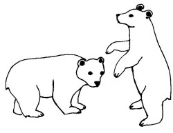
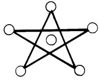

  
[Intangible Textual Heritage](../../../index)  [Native
American](../../index)  [Southwest](../index)  [Index](index) 
[Previous](yml15)  [Next](yml17) 

------------------------------------------------------------------------

p. 45

 

### The Two Bears

ONCE IN THE land of the Yaquis there were two very amusing men. One was
called Anoki'ichi and the other, Bali'ichi. Anoki'ichi was even funnier
than Bali'ichi. The two friends were inseparable. Together, they
traveled everywhere.

One day while walking about the countryside they killed a bear. They
skinned the bear very carefully, not harming the hide a bit. Anoki'ichi
then suggested to Bali'ichi, "Let's arrange this hide so that it is very
pretty."

They did. They filled it with grass so that it appeared to be a live
bear. That was well. They left it so for a few days. When they removed
the grass the stiff hide stood alone looking just like a bear.

Then Anoki'ichi said to Bali'ichi, "Now you get inside of the skin so
people will think it is really a bear. We'll go to all the rancherías
about here. I'll make a drum and play and sing to you while you dance
and act funny. That way we can earn money for food."

This was their plan. Bali'ichi got inside the

p. 46

skin and Anoki'ichi put a thick, rawhide rope about his neck. They set
off, Anoki'ichi carrying a big stick in one hand and the end of the rope
in the other. They visited all the little farms and ranches for many
months. Thus, one day they arrived at the house of a very rich man who
lived far from any other ranch or pueblo and had a very strong carrizo
fence. Anoki'ichi had Bali'ichi dance to a few songs accompanied by his
drum. The bear danced, and the owner of the house threw some money out.
The bear caught it, gave it to his master, and said thank you by
inclining his head and twirling around and around. After the fiesta, the
owner of the house decided this bear was very funny and wanted to buy
him.

"How much do you want for that bear? I will buy him no matter what he
may cost."

"Oh, no, no, sir, I will never sell this animal. He would die of
sadness, for I raised him since he was a wee, little one. Why he earns
me my living. If you should give me this house full of money, I couldn't
sell my bear," said Anoki'ichi.

"Well," said the chief of the house, "then I will give you a cartload of
gold for him and you can marry one of my daughters."

"Why, should you give me two cartloads and two women, I should not give
you my bear. I hold him in high esteem."

"Then tell me what you would like. The question of the bear's ownership
is settled; he is mine," said the householder. And he called two
servants and ordered them to get two carts ready and to fill one of them
with gold and the other with silver.

"Come on," the rich man said. "You will

p. 47

have this money and right over there you have a woman. Leave the bear
with me."

Anoki'ichi went over to the bear and said, "What do you say, my friend,
do I leave you?"

The bear shook his head "no," and wiped his eyes in order that all might
see that he was weeping. He stood on his hind legs and embraced his
master, Anoki'ichi. Into his ear he whispered, saying, "Don't do this to
me. Don't sell me!"

But Anoki'ichi already had his two carts of money and a very pretty
girl. Without a bit of shame, he gave the rich man the bear, took the
young Yaqui girl and all of the money and marched away. He left poor
Bali'ichi, sold.

The bear was put in a big corral where there was another bear. When
Bali'ichi saw the other bear lying in the shade of a ramada, he was
afraid. This other bear, who was also a man in disguise, was also
afraid. He got up and went slowly to meet the recently arrived bear.
Each approached the other, frightened to death. They were so afraid as
they neared one another, that each was reciting a prayer.

When they got very close together, each heard the other's voice and knew
that they both were only human.

"Are you a man too?" asked Bali'ichi.

"Yes," said the other bear.

"Aha. Let's pretend to fight so our master will think we are really
animals. Get down like this."

They threw one another about, and struggled for a long time. Then they
retired to rest. Thus their master was well satisfied. They fought like
this every day, giving each other swats and bites and hugs. For many
months this went on.

p. 48

But one day, when the master was sleeping during the siesta hour, the
two bears met.

"My face is hot in this skin," said one. "I'm going to take my head off
and get a breath of fresh air."

Undoing a string about his neck, he took off his mask and stuck his head
out. The other bear did the same, and the two commenced to have a
peaceful smoke. They chatted as they sat facing one another.

The owner awoke and saw the two bears chatting and smoking and he
realized that they were men. Furious, he went for his bow and arrows. To
the bears he said, "Ah, rascals, I found you out today and I am going to
kill you both!"

The two bears jumped over the carrizo fence and ran so fast nobody ever
caught them. To this day, no one knows where they are.

 

------------------------------------------------------------------------

[Next: The Walking Stone](yml17)
