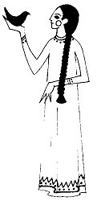

  
[Intangible Textual Heritage](../../../index.md)  [Native
American](../../index)  [Southwest](../index)  [Index](index.md) 
[Previous](yml16)  [Next](yml18.md) 

------------------------------------------------------------------------

p. 49

 

### The Walking Stone

THERE was a beautiful young woman by the name of Sawali Wiikit, or,
"Little Yellow Bird," who had lovely, long hair, and eyes as shining as
a star. But there was one thing about her that was bad. She was
disobedient, and she liked to walk about with her friends at night
without asking permission of either her father or her mother. She would
walk about until dawn and then come home to sleep.

One day, very early in the morning, Sawali Wiikit came into the house to
sleep. But before she could lie down her mother spoke to her, "Listen to
me, Sawali Wiikit, I don't want you to walk about like this either in
the nighttime or in the daytime. I want to you to help me with the
things of the household. It would be well for you to stop walking about
day and night."

p. 50

Sawali Wiikit did not reply, but she planned in her heart to continue on
her midnight walks in the company of men. She slept, and again at night
she left the house. She went to the home of another woman who always
went with her. This girl's name was Maso Hubi'aria. She didn't walk
about at night, but she would serve Sawali Wiikit pitahaya wine there in
her house. That night they drank and became intoxicated. By dawn, Sawali
Wiikit was quite drunk on pitahaya wine. When she arrived home, her
mother and her father spoke to her.

Her father said, "If you are not going to stop all of this vice and
begin to respect your parents, then you will do me the favor of going
away. Go anywhere you please."

"Yes, my father, I will go."

"Wait a moment," he said, and he went out of the house. The young girl
waited, and her father soon returned carrying a long, flexible branch.
With him came a maestro from the church of Rahum.

The maestro said to the girl, "So you think it better to leave your
mother and father forever?"

"Yes," replied Sawali Wiikit.

Then the maestro said to her father, "Punish your daughter so that she
will always remember you." So her father gave her three lashes. And he
said, "Now you may go."

The maestro accompanied her out of Rahum to the north. Near a mesquite
tree he said, "Here you may beg forgiveness of Dios for your sins and
your disobedience. If Dios forgives you, you may return to your home."

"But I don't want to return."

p. 51

"Well, then ask Dios for some penance."

So she knelt and said, "Dios, I do not want to return. I would rather
become a tree or a stone or an animal. I do not want to be a good
woman."

She had no more than finished speaking when she was changed into a
stone.

The maestro went back to Rahum and told what had happened. All of the
young people were frightened and were very good to their parents
thereafter.

The stone of Sawali Wiikit walked from there to Rahum, to Guamuchil, to
Potam, and toward Torim. Sometimes people would put it on top of a
mesquite tree, but the next day they would find it somewhere else. Once
they found it near Lencho, and they carried it to Torim and put it in
front of the church. But it was not there at dawn. It is said that
lately it has been seen in the vicinity of Vicam. This is the story of
Sawali Wiikit, the walking stone. It ends here.

 

------------------------------------------------------------------------

[Next: Sun and Moon](yml18.md)
