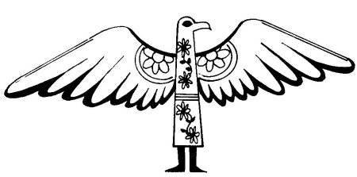
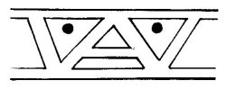

  
[Intangible Textual Heritage](../../../index)  [Native
American](../../index)  [Southwest](../index)  [Index](index) 
[Previous](yml19)  [Next](yml21) 

------------------------------------------------------------------------

p. 59

 

### The Man Who Became a Buzzard

NEAR the pueblo of Bacum there once lived a Yaqui called Malon Yeka,
which means Prairie Dog Nose. He was a man with deep and profound
desires to know much and have many things within his power. He wanted to
have all sorts of things, without working. He had a wife and a number of
children. However, he was lazy. He wanted everything to come to him by
miracle. Also, he possessed a number of strange ideas. Sometimes he
would have the desire to travel underground, and he dreamed of
subterranean passages which were very dark. Other times he awoke with
the desire to fly like the birds.

p. 60

One day he took a little cottonwood bench and went off to sit in the
shade of a tree near his hut. Seated there with a hand on his right hip,
he watched many birds fly about. Among them were some buzzards,
vultures, and crows. "Thus, thus I should like to fly," said Malon Yeka.

Suddenly a buzzard came down close to him and said, "What is it that you
are thinking about?"

"Almost nothing," answered Malon Yeka. "I was wishing I could be a
buzzard like you, and could fly as high as you and see as far as you."

"Well, I am going to give you your wish," said the buzzard, taking off
his plumage and wings as if they were a little house. He handed them to
the man and said, "Now give me your shirt and pants. We will exchange
places for six days. You will become a buzzard so that you may go high
against the wind to wherever you desire, and I will stay here in your
place.

"It suits me," said Malon Yeka.

"Listen well to me," said the buzzard. "The life of a buzzard is very
hard. There are days when there is nothing to cat. Buzzard food is not
sure thing. Sometimes, if there should be some dead animal, you will
have plenty. But between times you will suffer much hunger."

Then they parted. The buzzard became a man and the man became a buzzard.

The buzzard, who was now a man, was not accustomed to walking. He went
about laboriously, giving little hops because he did not know how to
take normal steps like a man. That night he ate the food they served
him. Then he went to bed, close to the man's wife. She could not sleep
the whole night long because of the buzzard

p. 61

smell. He smelled of dead horse. During the daytime everyone looked with
surprise upon his mode of walking.

The man who was now a buzzard did not have any time to fly as he had
wished. He hopped about from branch to branch, hoping to find some dead
animal. At night he arrived at a ranch where they were making cheese. He
was very hungry. He flew down to the house and went close to where they
were making cheese. A little girl said, "Look at this clean buzzard! I
think he is a pet from some other house. I believe they must have beaten
him and he ran over here. Give the poor little one something to eat."

But they would not give him anything.

The man who was a buzzard went away, hopping. He was too weak from
hunger to fly.

When the six days had passed, the real buzzard presented himself to the
man who gave him back his plumage and his thanks, saying, "I no longer
wish to be a buzzard, for I know what hunger is."

Thus they took leave of one another. The bird flew off and the man
returned to his house, his desires satisfied. Never again did he wish to
be a buzzard.

 

------------------------------------------------------------------------

[Next: The Snake People](yml21)
