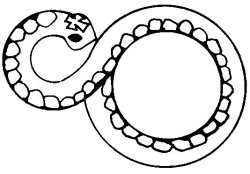

  
[Intangible Textual Heritage](../../../index.md)  [Native
American](../../index)  [Southwest](../index)  [Index](index.md) 
[Previous](yml20)  [Next](yml22.md) 

------------------------------------------------------------------------

p. 62

 

### The Snake People

LONG AGO there lived a Yaqui by the name of Habiel Mo'el. He was an
orphan, but he had many relatives all over the Yaqui country. This man
did not enjoy hunting as most young Yaqui men did. Instead, he liked lo
travel from house to house and from pueblo to pueblo, attending fiestas
and eating and chatting with his friends and relatives.

The only weapon he ever carried was a big, thick club. He lived at the
foot of the hill, Mete'etomakame. One day he started out for Hekatakari
where there was to be a little fiesta. When he came to Maata'ale, the
monte became too thick for passage, and he turned around and went to
Jori. From Jori, he cut across toward Bataconsica, where an arroyo
empties into the Rio Yaqui. Travel there was very difficult, for the
undergrowth was extremely dense. He crawled on his belly under branches,
crawled over them, or pushed past them.

When he came upon a sort of clearing, a big snake appeared, crawling
across his path. Habiel Mo'el hit the snake right in its middle, but it
vanished into the underbrush before he could strike it again. So he
continued on his path toward the ranchería at Hekatakari.

Suddenly, what had been nothing but thick monte stretching before him
became a large Yaqui pueblo with many people in it, moving about their
business. Habiel Mo'el felt very

p. 63

strange. As he walked between the houses, a *cabo* from the *guardia*
came up to him. and greeted him.

He told Habiel Mo'el that his chief would like to see him at the
guardia. So the two went over there. Inside, on the front bench was
seated the head *kobanao*. On the next bench, [Habiel](errata.htm#3.md)
Mo'el was told to seat himself. The other *kobanaom* were seated on the
other benches. To one side a young girl was sitting. About her waist was
a bandage of leaves.

The head *kobanao* spoke to Habiel Mo'el, "We have brought you here to
ask you why you beat a girl this afternoon as you were traveling along
between Jori and Bataconsica.

Habiel Mo'el was very surprised. He replied that from Jori to this place
he had met no one on his journey. "I did not beat any girl," he said.

"You struck a girl this afternoon, and you are liable to punishment. Why
did you do this?" insisted the kobanaom.

Habiel Mo'el could not remember having done so; and he repeated this.
Then he explained where he had come from and his route, saying that he
had seen no girl on the path. He respectfully asked their pardon, but
insisted that he had done nothing at all.

The head *kobanao* turned to the girl, who was seated to one side, and
asked her if this were the man who had beaten her.

"Yes," she answered. "'And he is still carrying the stick with which he
beat me and almost killed me. That is the man."

Habiel Mo'el said that he had never seen the girl before and that he
remembered nothing of

p. 64

it. He again asked their pardon, but disclaimed guilt. The *kobanaom*
considered the matter among themselves.

Then the head *kobanao* said, "We will pardon you this once, since it is
your first offense. But after this, when you are traveling, never harm
anyone at all who may cross your path offering you no danger. You may go
this time."

Habiel Mo'el thanked them and left the guardia. As he went out, he found
himself in the middle of the monte with no sign of a village.

He traveled on toward his destination. It was dark when he arrived at
Hekatakari and the house of his relative. He greeted the little old man
whose name was Wete'epoi.

They sat down to a meal of pitahaya and Habiel Mo'el told Wete'epoi
about his strange experience concerning the appearance and disappearance
of the large Yaqui pueblo, and of his accusation.

The old man listened and then said, "You have done a great wrong. All
animals, as well as people, have their authorities and their laws. You
hurt a snake which crossed your path, doing you no harm. The authorities
of that group took action against you. You must never again do that
thing. The chiefs of the snakes met when the girl complained. They
turned into people to punish you. I will give you some advice. Never
hurt any snake, coyote, or any kind of animal, which is just crossing
your path and offering no harm. If a snake lies coiled in the path, kill
it. You are defending yourself then. But always kill it completely,
never let it get away or it will complain and its chiefs will punish
you."

------------------------------------------------------------------------

[Next: Omteme](yml22.md)
