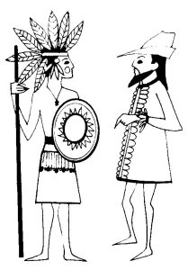
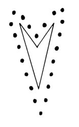

  
[Intangible Textual Heritage](../../../index)  [Native
American](../../index)  [Southwest](../index)  [Index](index) 
[Previous](yml21)  [Next](yml23) 

------------------------------------------------------------------------

p. 65

 

### Omteme

WHEN YOMUMULI took her people, the Surem, and went away to the north
because she did not like the things said by the talking stick, she left
governors behind for each region. These chiefs lived on the tops of
mountains along the Rio Yaqui. There was one governor who lived in the
hill of Omteme. He was very wise. He knew that the Conquest would come
and all of the things it would bring with it. He knew that it would come
with two words--good and bad. All of this he knew from the stick that
talked. The name of this chief was Omteme, which means "He is Angry."
Omteme was standing on top of his hill when Columbus came into port at
Guaymas. He was very angry because he knew that the Spaniards were
coming with treachery.

Columbus climbed a hill near Guaymas, which is now called Takalaim and
he saw Omteme in the distance. Omteme wanted to know what the conqueror
intended to do, so he asked, "On what conditions do you want to make the
Conquest?"

Since Columbus did not have a good heart,

p. 66

he took his big gun and shot at Omteme. The shot fell short and Omteme
asked again, "What do you want? What are you doing?"

Columbus shot a second time, this time coming closer, but not quite
reaching Omteme. The chief did not understand guns. He still kept asking
of the conqueror how he intended to make the Conquest.

Columbus shot a third time and the ball reached the foot of Omteme's
hill. When Omteme saw the shot he said, "Oh, so you want war!"

He took his bow and an arrow and he shot. The arrow hit the top of the
hill on which the conqueror stood, splitting the mountain in two. The
conqueror fell into the sea and drowned.

Then Omteme spoke to his people. "You who wish to, may stay. I am
leaving now." And he descended into the heart of his hill.

Most of the people also went into the mountains or into the sea, for
they could not accept the Conquest. Like their chief, Omteme, they said,
"I am leaving now." LC

 

------------------------------------------------------------------------

[Next: Juan Sin Miedo](yml23)
