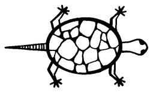

  
[Intangible Textual Heritage](../../../index)  [Native
American](../../index)  [Southwest](../index)  [Index](index) 
[Previous](yml24)  [Next](yml26) 

------------------------------------------------------------------------

p. 78

 

### Kaiman

DOWN on the Yaqui River the waters of the sea once rose and reached far
up into the monte where many things were growing, such as *sinam*,
*choan*, and *ono'em*. Among all these natural plants, the water came
and carried with it the great turtle, Kaiman. Thus has it been said.

When the waters receded this great animal remained on the ground among
the trees. And it could not raise itself.

After the flood, a Yaqui [encountered](errata.htm#4) this Kaiman
stretched in the sun. When the Yaquis see such a thing, they always feel
pity. This trait of the Yaquis is very stupid. The man placed the huge
Kaiman on his shoulders. It was heavy. And he carried it to the river.
Arriving at the bank, he entered the water up to his knees, and started
to put the animal down into the water.

Kaiman then spoke, "There is very little water here. Would you be so
kind as to carry me out a bit farther. I am very weak and hungry."

p. 79

So the Yaqui carried him out until the water reached to his waist.

"Oh," said Kaiman, "farther than this, please, just a little farther."

"I can't walk very well," said the man, "but I will do what you ask."
Until the water reached his neck, he carried the animal out and then put
him down.

"I wish you might have carried me farther out," said Kaiman. "But this
will do. Now I would like to ask the favor of eating you."

The man could not move. He said, "Are you not satisfied that I have done
you a great favor? Why should you now want to eat me?"

"Don't you know that a good deed is always paid with evil?"

The man was very sad to hear this. He had no strength now. "Very well,"
he said, "But wait a minute. Over there comes someone who may know if it
is right for you to eat me or not."

A dog appeared at the edge of the river to take a drink. The turtle
spoke to the dog, saying, "Is it not certain that a good deed is always
repaid with evil?"

"Why?" asked the dog.

"Because I should like to eat this man."

"Eat him, then. Man is bad. He beats us."

But the man said, "Wait. Here comes another friend of mine who might
help me."

A horse came up. To him Kaiman said, "Is it not true that a good deed is
paid with evil?"

"Why?" said the horse.

To him also, Kaiman said, "Because I wish to eat this man."

Said the horse, "Then eat him."

p. 80

Then along came a goat, and other animals of the household. And every
one of them answered, "Eat him."

Last of all came Coyote. Kaiman was getting restless and more and more
hungry. But he said to Coyote, "It is true is it not, that a good deed
is paid with evil?"

"What's that you say?" asked Coyote. "I am a bit deaf." Coyote had
learned this trick from the Mexicans. "Come a little nearer. I can't
hear a thing you say."

"Isn't it true that a good deed is paid with evil?" asked Kaiman, moving
closer to Coyote. "I want to eat this man."

"What did this man do?" asks Coyote.

"He carried me into the deep water."

"Yes, I carried him here," said the man.

"And from where?" asks Coyote.

"From the monte."

"Well," says Coyote, "Let us go to the monte. There's where the trouble
started." Then he asks, "And how did this man carry you?"

"Why, this way."

"Well, carry him that way, then," said Coyote to the man. So the man
picked up Kaiman and carried him back to the monte.

"Here we are," says Kaiman.

"Well," says Coyote, "Put him down the way you found him." Then he asks,
"Were you in that position?"

"Yes," replies Kaiman, "Like this."

"All right," says Coyote to the man, "leave him there. And don't ever
pick up this kind of animal again."

And Coyote ate Kaiman. LC

------------------------------------------------------------------------

[Next: The Big Bird](yml26)
