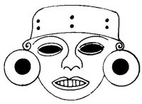

  
[Intangible Textual Heritage](../../../index)  [Native
American](../../index)  [Southwest](../index)  [Index](index) 
[Previous](yml26)  [Next](yml28) 

------------------------------------------------------------------------

p. 88

 

### The Wars Against the Mexicans

TOMAS CUPIZ traveled with his soldiers; there were forty. Beneath him
was Francisco Flores, called Chico Matachini. His aide was Apolinar
Pina, called Poli Soso'oki. These Indians left their families in the
sierra of Chikurim in the care of Alejandro Rodrigues and Juan María
Buitime'a and the old man, Paame'a. Tomas Cúpiz and his forty men went
away, going down by way of Wicharubui in the direction of Torim. They
crossed the river near Chu'umeampa'ako and from there went down to
Wikicheba'am, the water hole of the birds. In this spot they killed
animals for food, three burros, a mule, and two horses. They ate and
carried the meat from these animals. They passed through the pueblo of
Vicam which had been abandoned by its people. All of this occurred in
the time after Madero, in 1912.

The men took water from the river and again took to the trail, slowly
because of the great heat. It was the month of May. They neared
Wicharubui and began to ascend the steep slope of the sierra. By the
time they were half way across the sierra their canteens were empty of
water. They tried to get water in the arroyo called Huchakowhoi. Every
one seated himself on the rocks and rolled up his pant legs in
preparation for the descent. There was great danger in the region of the
water, for a detachment of federal soldiers, about four hundred men, was
camped there. And the forty Yaquis had to have water from that arroyo.
They left their packs of meat in the care of an old Yaqui called Belen,
a relative of mine. Belen remained on guard on the top of the hill.
Tomas Cúpiz and the others cautiously

p. 89

descended to the floor of the arroyo and began to drag themselves on
their bellies in the direction of the water guarded by the federals.
They were close to the soldiers when they stopped for a moment to catch
their breath. The federals were not aware of them, although they were
but three hundred meters away.

Tomas Cúpiz, lying flat on his belly, began to move a stone which he
discovered loose before him. He pulled it up and beneath it was a small
spring of beautiful, fresh water. All loosed the cups from their belts
and drank to calm their thirst. Then they filled their canteens and also
that of Belen. From there they retreated to the top of the rocky hill.

Belen, after drinking twice, spoke to them. "Since you went down, I have
been hearing gun shots from the direction of Chikurim."

"What might they be doing to our families?" said Chico Matachini.

Immediately they shouldered their packs and set out in file. All were
full of anger and they traveled swiftly. As they went down on the plain
they met María Buitime'a who had been running, and behind him came
Alejandro Rodrigues.

Then Poli Soso'oki asked of Alejandro, "What took place in Chikurim?"

Alejandro replied, "There arrived more than three hundred *pelones*,
well armed, and they made pieces of us."

"And Paame'a?" asked Tomas Cúpiz.

"He was one of the first killed," replied Alejandro. "The only ones
saved were ourselves and Rosalino Bakanawa and Rosalino Yolim'a and Tako
Saruuki, for we ran."

"What of our families?" asked Pooli Pina.

p. 90

"Let us go and give our families help. Shall it be this way or shall we
make a turn by way of Ya'awimbwa'awa'apo?" said Chico Matachini.

Then answered Alejandro Rodrigues, "It is better that we turn that way."

"That we shall do," said the old man, Belen.

So they all retraced their steps down the same hill, passing near
Wicharubui, in the direction of the disappearing sun. They took a small,
flat stretch in the direction of the arroyo of Ayawimbwa'awakawi. They
followed the arroyo from above. The sun had now set. They traveled
laboriously through the craggy canyon. Without sleep they climbed toward
the top of the hill. They kept marching without food or drink and in the
early morning they arrived at Chikurim.

No one was to be seen. The federal soldiers had carried away some
families and others were hidden in caves, in arroyos, and in the monte.
Tomas Cúpiz and his men dispersed throughout the countryside searching
out the wounded and dead and the frightened women. Children were dying
of thirst. The first encountered by Tomas Cúpiz was a young girl called
Sewakame. She lay beneath a small tree that cast no shade and was almost
dead. He took her in his arms and placed her in the shade and gave her
water.

Alejandro and Juan María Buitime'a built a fire to cook meat and feed
the people. Others walked in search of the dead, to burn them. José
Kome'ela, a cousin of mine, and others brought in a number of girls they
had found, also nearly dead of hunger and thirst. When the meat was
cooked, they made a broth with which to nourish them. And soon the
families were removed to the southern part of the sierra Bacatete.

------------------------------------------------------------------------

[Next: War Between the Yaquis and the Pimas](yml28)
