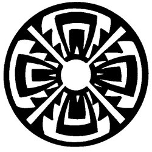

  
[Intangible Textual Heritage](../../../index)  [Native
American](../../index)  [Southwest](../index)  [Index](index) 
[Previous](yml27)  [Next](yml29) 

------------------------------------------------------------------------

p. 91

 

### War Between the Yaquis and the Pimas

LIKE ALL OTHER tribes, the Pimas recognized the Yaquis as their supreme
authority. However, in life no thing is perfect nor lasting; so it
happened that one day at the fiesta celebrating San Juan's day, the
Yaquis and the Pimas had a terrible quarrel. The fiesta was taking place
near the hill of Echoakame. The trouble was caused by a trifle, a mean
little act.

The Pimas wanted permission to borrow the image of San Juan from the
Yaquis in order that they might carry it to their pueblo, that is, to
Onabachi. But the Yaquis flatly denied them the privilege. There was a
great discussion and the disgruntled Pimas then retired to their
homeland, some to No'obachi, others to Onabachi, Tonichi, or Nu'uram.

A few days later the Pimas sent an emissary to see the Yaqui leaders,
carrying the ultimatum that if the Yaquis would not allow them the use
of their saint, the Pima tribe would rise in arms and take San Juan by
force.

The Yaquis answered only that they were ready to receive the Pimas.

Three weeks later, over six hundred Pimas came toward the Yaqui
territory in warlike guise, well armed with bows and arrows and lances.

p. 92

A scout who was guarding the Yaqui territory, saw the Pimas approaching.
He immediately informed his chief, who then armed many Yaquis in
readiness for the encounter.

The Pimas attacked suddenly and with great force. The Yaqui soldiers
were well armed and equipped, and excellent marksmen. They fought for
some time. Finally the Pimas, seeing such resistance in their enemy,
began to retreat and abandon the field. The Yaquis, in mass, followed
them, and pushed them at the point of their arrows to a place called El
Realito.

There the Yaquis mounted a long, low hill. They camped at one end of the
mesa. The Pimas camped at the other end of the mesa, among a small clump
of trees. Night fell, with neither the Pimas or the Yaquis showing any
battle. As it darkened, the Yaquis could see a multitude of little
lights such as those of cigarette coals at the Pima camp. It appeared as
if all of the Pimas were smoking. The Yaquis realized that there were
many Pimas, and they said to one another, "Let us go after them in the
early morning."

At four in the morning, the Yaquis started toward the Pima encampment.
Before six they arrived at the spot where they had seen the cigarettes
burning the night before. But they encountered no one--not even the
ashes of the cigarettes which had been smoked.

"What does this mean?" asked Cocheme'a.

"It means that those Pimas are wizards and that they have tricked us.
They left yesterday, after resting, and only their witcheries remained
here to keep us occupied," said Naawa.

------------------------------------------------------------------------

[Next: Peace at Pitahaya](yml29)
