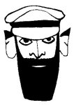

  
[Intangible Textual Heritage](../../../index.md)  [Native
American](../../index)  [Southwest](../index)  [Index](index.md) 
[Previous](yml28)  [Next](yml30.md) 

------------------------------------------------------------------------

p. 93

 

### Peace at Pitahaya

Pitahaya, Rio Yaqui, January 9, 1909

PEACE WAS made at Pitahaya with the eight pueblos of this tribe while
Luis Buli was General of the Yaquis. Yzábal was governor, and the
generals of the Mexican forces were Lorenzo Torres and Luis Torres. Also
there were some people from North America as representatives at this
peace. A party of Papagos attended. They came as witches in order to do
harm to the Yaquis. That is why Yzábal won this peace.

Yzábal brought with him a Padre to bless the laying down of the Yaquis'
arms. On the eighth day they began to discuss the peace. Yzábal and Luis
Torres and Lorenzo Torres questioned the pueblos concerning how to make
this peace. The old men of our tribe said that they should set up a
cross for the swearing of the oaths. They said that two persons from
each side should be named to swear the peace and an image should be
placed between those two persons during the taking of the oaths. That
was the form in which the peace should be arranged. And so it was done.

The people of the government numbered sixty thousand. The whole valley
of Pitahaya was covered with soldiers as far back as the sierra. Of the
Yaquis, there numbered 90 men.

p. 94

The Mexican soldiers placed out two boxes, one for our equipment and one
for our arms. And they began to disarm the Yaquis. Yzábal said to Luis
Buli, "Now you will be disarmed, all of your people. These arms must be
blessed, for they have sinned. They have killed many people," said the
generals of the government. "Now you are in our power. God has punished
you," they said to Luis Buli.

Then Luis Buli said to them, "You did not inform me of this yesterday
during our arrangement of the peace. Therefore, I cannot order that
these arms be turned over to you." These were the words of General Luis
Buli.

The Mexican generals began to order movement of their troops. We were
surrounded by double columns. They began to disarm the Yaquis. They came
to two men of General Buli's guard to disarm them. These two men
attacked Yzábal, their bayonets drawn, and said to him, "Keep your word
as the peace was made!"

Yzábal and Luis Torres gaped with their mouths wide open. The other
Torres shouted for order. And we of the federation who had all gathered
round were quieted. This took place near the village of Pitahaya.

Of those two men of this unhappy tribe, one fell in the following
battle. His name is acclaimed in our memories. He was Santiago Guicoyoi.
The second was Tiburcio Agraciamacqui. These are the two men who put
their bayonets at the breast of the generals of the government.

Yzábal died of fright in some state in Europe after soiling his pants
during the peace pact at Pitahaya. This is very positive in our history.
JV

------------------------------------------------------------------------

[Next: Malinero'okai](yml30.md)
