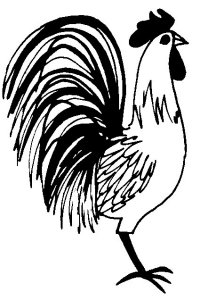

  
[Intangible Textual Heritage](../../../index.md)  [Native
American](../../index)  [Southwest](../index)  [Index](index.md) 
[Previous](yml33)  [Next](yml35.md) 

------------------------------------------------------------------------

p. 110

### San Pedro and Cristo

ONE TIME San Pedro and Jesucristo were walking along, and Jesucristo
sent San Pedro up to a near-by house to get a cooked chicken. On the way
back Pedro ate one leg of the chicken.

When Jesucristo saw what San Pedro had brought back, he asked, "Why has
this chicken but one leg?"

"It never had another leg," answered Pedro. "All of the chickens around
this part of the country have but one leg, Sir."

The two proceeded and came to a big tree under which were sleeping many
chickens. All of the chickens had one leg tucked up out of sight under
their feathers.

Pedro pointed to them and said, "You see! All of the chickens have but
one leg apiece."

Jesucristo took a rock and threw it at one of the chickens. It woke up
and stood on both feet.

"Oh," said Pedro, "A miracle!" He then took up a rock and threw it at
the rest of the chickens. "You see," he said, "I can perform miracles,
too."

 

------------------------------------------------------------------------

[Next: Jesucristo and San Pedro](yml35.md)
