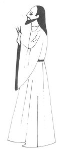
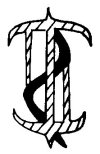

  
[Intangible Textual Heritage](../../../index)  [Native
American](../../index)  [Southwest](../index)  [Index](index) 
[Previous](yml34)  [Next](yml36) 

------------------------------------------------------------------------

p. 111

 

### Jesucristo and San Pedro

JESUCRISTO walked about talking with sick men. When Lazaro was dead,
Jesucristo brought him to life.

San Pedro was always envious thinking how sad it was that Jesucristo
never charged a fee for his services in curing and bringing people to
life. "Oh, how sad," he thought. "If it had been I who cured Lazaro, I
should have asked a great deal of money." He was wondering if perhaps he
couldn't bring the dead to life as Jesucristo did.

They walked to another pueblo, arriving at an early hour. Jesucristo
cured some people there and San Pedro was still hoping that he would
charge a little fee.

Jesucristo taught the people about curing. "This herb has the power to
cure snake bite," he said. In this way he taught the Yaquis.

San Pedro wanted also to cure as did Jesucristo. By now he had learned
all of the prayers and how to gesture as Jesucristo did. One day he

p. 112

hid from the others. He walked to a place where a sick man lived, for he
wanted to make a cure all by himself. San Pedro performed something like
an operation on this man, making many motions and prayers, and using
some cure. The hour came and passed, and San Pedro could not revive the
patient. He was frightened. He left, calling on Dios for help with all
his heart. He found Jesucristo and said to him, "I need you. I could not
revive my patient."

"Very well," said [Jesucristo](errata.htm#7), and he went to the place
where the dead man was. He put out his hand and said, "Rise up, José,"
and the dead man came to life.

San Pedro is always very quick to beg pardon. He asked forgiveness of
Jesucristo and of course he was pardoned.

San Pedro did not continue in this capricious way . Now he is very good
at curing; but always with the help of Jesucristo. LC

 

------------------------------------------------------------------------

[Next: Pedro de Ordimales](yml36)
