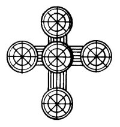

  
[Intangible Textual Heritage](../../../index.md)  [Native
American](../../index)  [Southwest](../index)  [Index](index.md) 
[Previous](yml35)  [Next](yml37.md) 

------------------------------------------------------------------------

p. 113

 

### Pedro de Ordimales

PEDRO DE ORDIMALES and Jesucristo were walking along a road. Pedro, who
was following behind, picked some figs and put them in his bag, not
mentioning the action to Cristo. When he was hungry, he reached into the
bag and pulled out a fig and ate it. Jesucristo, without turning around,
said, "What are you eating, Pedro?"

"Oh, just some burro excrement, sir."

A little later Pedro de Ordimales was hungry again and reached into his
bag for another fig. He pulled out a piece of burro dung.

Cycles of stories about Pedro de Ordimales (or Urdimales) have spread
from Europe to the Spanish American population of this continent and are
common today. For a discussion of their distribution see: Espinosa
1914b: 220-221; Mason and Espinosa 1914: 166-171, 206-207.

------------------------------------------------------------------------

[Next: San Pedro and the Devil](yml37.md)
